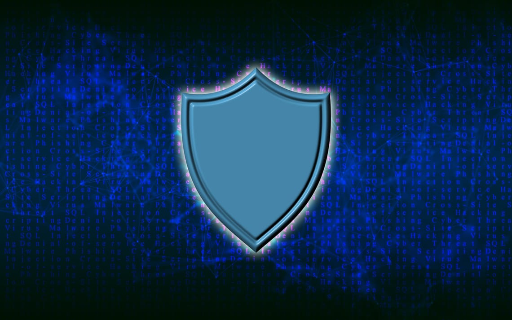

October marks **Cybersecurity Awareness Month**, a reminder that protecting yourself online is more crucial than ever. Although this campaign began in the U.S. back in 2004, its message is universal: **no matter where you are, staying safe online should always be a priority.**

In the spirit of this annual event, I’d like to share some practical tips I’ve gathered from financial institutions, cybersecurity experts, and various podcasts I follow. These suggestions will help you safeguard your digital life and keep potential cyberthreats at bay.

## 1. Create Strong, Unique Passwords

You’ve probably heard that a strong password requires a combination of uppercase and lowercase letters, numbers, and special characters. But let’s face it, “aA1#” just isn’t going to cut it. Attackers can easily breach such basic combinations. In fact, weak passwords are often cracked in seconds.

To give you an idea of how long your password should be, this infographic from Response IT shows an estimate of how long passwords take to crack depending on their composition:

How long will it take to crack your password?

## 2. Avoid Reusing Passwords

One of the most common mistakes people make is reusing the same password across multiple accounts. I’ve even had colleagues admit to using one password for everything, which is a disaster waiting to happen. If one account is breached, attackers can easily access all of your other accounts using the same password.

The solution?

Use different passwords for every account. And yes, I know—coming up with unique passwords for every account can be difficult. That’s why I recommend using systems like [Diceware](https://diceware.dmuth.org/?ref=joanadvincula.xyz) or the [Bitwarden Strong Password Generator](https://bitwarden.com/password-generator/?ref=joanadvincula.xyz) to create secure passwords.

## 3. Use a Password Vault

At this point, you might be wondering how on earth you’re supposed to remember all these passwords. You’re right to be concerned—managing hundreds of accounts is a challenge. That’s where password vaults come in.

A password manager, like [Bitwarden](https://bitwarden.com/?ref=joanadvincula.xyz), securely stores all your passwords in one place. It generates strong passwords for each account and auto-fills them when you need them. Plus, you only have to remember one master password.

Trust me, it’s a lifesaver. (And no, Bitwarden didn’t pay me to say that!)

## 4. Monitor Your Email

Keeping an eye on your email accounts is crucial, but it’s more than just checking your inbox. You need to ensure that your email hasn’t been compromised in a data breach. Tools like [Firefox Monitor](https://monitor.firefox.com/?ref=joanadvincula.xyz) can help. By entering your email, you can see whether it’s been involved in any breaches, and you can even sign up for alerts in case it happens in the future.

## 5. Be Mindful of Every Click

Cybercriminals often prey on impatience or carelessness. Whether you’re clicking a link, downloading a file, or making a payment, **be mindful**.

Ask yourself: does this seem too good to be true? If something feels off, don’t rush — **double-check before you act**.

## 6. Stay Calm, Don’t Panic

Lastly, never let yourself be rushed or panicked into making a quick decision online. Your bank, or any legitimate institution, will never push you to take immediate action without giving you time to think.

Scammers thrive on urgency. If you feel pressured by an unexpected message or call, stop, breathe, and take a moment before doing anything. This simple pause could save you from a costly mistake.

---

These are just a few simple tips that I hope will help you stay safer in your online life. Cybersecurity is an ever-evolving field, and there’s always more to learn. If you have any additional tips or personal experiences to share, feel free to drop them in the comments.

**Stay vigilant, and happy browsing!**

(This post may be updated in the future with more tips or followed up with a deeper dive into cybersecurity best practices.)

---

Originally posted on October 27, 2022 at [Substack](https://joanadvincula.substack.com/p/secure-yourself-online?ref=joanadvincula.xyz).