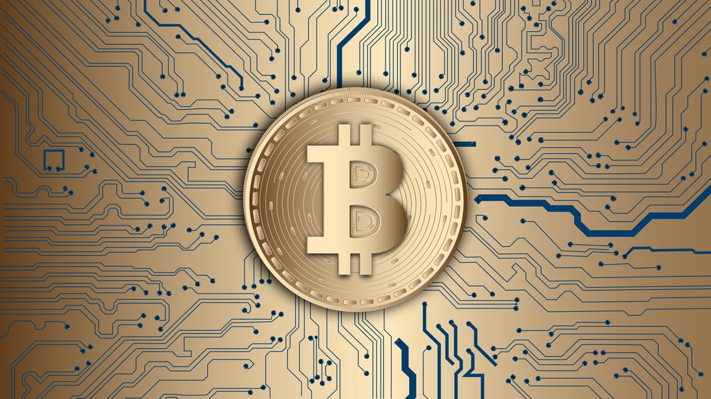

What exactly is Bitcoin? What was it meant to be? These were the questions I asked myself a few weeks ago after reading a newsletter from a writer I follow. He doesn’t typically write about finance, but this time, he was sharing strategies to avoid financial hardship during the ongoing economic downturn.

Surprisingly, he mentioned Bitcoin — and not in a dismissive way, but as something still worth keeping in a portfolio, albeit in smaller quantities.

The mention of Bitcoin made me think.

Even after all it’s been through, from surging to over $68,000 in November 2021 to the volatility that followed, Bitcoin hasn’t faded into the background. But why?

## What is Bitcoin?

Bitcoin, as we know, was created during the 2008 financial crisis by an entity known as Satoshi Nakamoto. It promised to revolutionize transactions by allowing people to transfer money directly to each other without the need for intermediaries, like banks.

In theory, it would have functioned like a universal, peer-to-peer currency.

## But is that what Bitcoin is today?

Not exactly.

Yes, Bitcoin is still a form of currency. You can technically use it to buy things if you find merchants willing to accept it. But here's the problem: Bitcoin is so volatile that its value changes drastically within short periods. If you spend Bitcoin today, you might regret it tomorrow when its value skyrockets.

This volatility is not exclusive to Bitcoin; it ripples through other cryptocurrencies as well. When Bitcoin’s value goes up, the rest of the crypto market often follows, and the same happens when Bitcoin tanks.

So, I couldn’t help but ask: Can Bitcoin — or any cryptocurrency — ever become like regular currency?

## Bitcoin as currency?

As things stand, no.

People aren’t holding onto Bitcoin to use it as a daily medium of exchange. Instead, they treat it like an asset, a tech stock, something to trade and profit from. Even some experts liken Bitcoin’s rise to an economic bubble, while others predict that its value could soar past $100,000 in the near future, with some estimates going into the millions.

Given this level of volatility, using Bitcoin like we use regular currency just doesn’t make sense. So if it’s not functioning as the peer-to-peer payment system it was designed to be, what is Bitcoin’s purpose today?

## Bitcoin Today

In short, Bitcoin’s value comes from people believing it has value, much like gold or diamonds. It’s no longer about its practical utility but about its perception as a valuable asset.

Of course, this oversimplifies things. The underlying technology behind Bitcoin, blockchain, does have broader applications that could transform industries. But for now, Bitcoin itself has evolved into something far different from the peer-to-peer currency Nakamoto envisioned.

As for the future of Bitcoin?

It’s anyone’s guess.

But one thing remains clear: Bitcoin has become a part of our financial landscape, even if it’s not fulfilling its original promise.

As they say in the crypto world — **to the moon!**

---

**Sources:**

- Bitcoin, [https://en.wikipedia.org/wiki/Bitcoin](https://en.wikipedia.org/wiki/Bitcoin)
- Bitcoin Price History: 2009 to 2022, [https://time.com/nextadvisor/investing/cryptocurrency/bitcoin-price-history/](https://time.com/nextadvisor/investing/cryptocurrency/bitcoin-price-history/)

---

**Disclaimer:** *This article is not to be taken as financial advice. I am not an economic expert, nor a finance expert, and I do not claim to be either. This article was written to answer some of my curiosities about Bitcoin and all crypto.*

---

*Originally posted on November 4, 2022 at [Substack](https://joanadvincula.substack.com/p/bitcoin-today-is-not-what-it-was?ref=joanadvincula.xyz).*