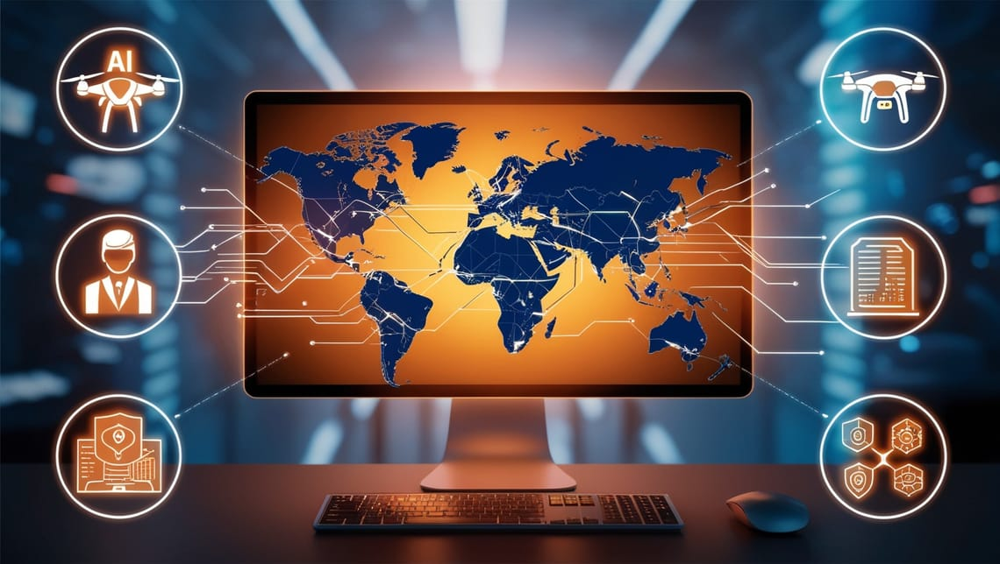

Cybercrime is no longer confined to a shadowy figure hacking into government systems — it’s become an everyday threat, affecting everything from personal finances to global stability.

As crime moves from the streets to your screens, understanding the evolution of cybercrime and the tools used to fight back has never been more critical.

## From Gangs to Geeks: Crime's Digital Shift

Criminals have traded dark alleyways for digital ones.

**Once associated with street gangs and physical theft, crime has now migrated to our screens, becoming a major global issue.**

Traditional crimes like extortion, fraud, and even robbery have evolved into their digital counterparts — ransomware, phishing, and identity theft. These digital crimes are no less dangerous than their physical predecessors; they can devastate lives just as effectively.

With online banking, social media, and mobile apps being prime targets, cybercriminals have mastered the art of exploiting human and technological vulnerabilities.

For example, the Lazarus Group, linked to North Korea, pulled off one of the biggest cryptocurrency heists in 2022, stealing over $600 million worth of cryptocurrency on the Ronin Network. This case highlights just how interconnected global digital crime has become, often leaving victims across multiple countries in its wake.

Cybercrime is evolving, and criminals are moving faster than ever.

Our digital world has opened up new doors for criminal activity, and we need to stay vigilant as we navigate it.

## The Ripple Effect: How One Hack Can Change Everything

The effects of cybercrime go far beyond the immediate victim.

One successful hack can ripple through entire communities, disrupting lives and causing irreversible damage.

In the Philippines, 43% of phishing attacks in 2022 targeted the financial sector, affecting thousands of individuals and businesses.

Financial losses can be crippling, but it’s not just about the money. There’s also the emotional toll. **Cybercrime victims report feelings of violation, helplessness, and anxiety, which can persist long after the incident.**

When a hospital or government office is targeted, it’s not just the organization that suffers — entire communities feel the impact.

For instance, during the pandemic, ransomware attacks targeted healthcare systems throughout the world, delaying services and compromising patient data during a critical time in the pandemic.

Cybercrime doesn’t just target individuals—it can paralyze entire institutions, leaving lasting scars on society. The ripple effect is real, and it can be devastating.

## The Future of Cybercrime: 7 Alarming Trends to Watch

Cybercriminals are constantly adapting to new technologies, and the next decade will bring even more sophisticated threats. Here are seven trends that will define the future of digital crime:

- **AI-Powered Attacks**: Cybercriminals are leveraging artificial intelligence to launch more precise and effective attacks. AI can automate phishing campaigns, learn from past breaches, and outsmart traditional security systems.
- **Ransomware as a Service (RaaS)**: Just like software, ransomware has become a service that anyone can buy. This makes it easier for criminals with limited technical skills to carry out attacks.
- **Deepfakes**: AI-generated deepfakes are a rising concern, as criminals use them to impersonate individuals, creating fraudulent scenarios and causing chaos.
- **Supply Chain Attacks**: Hackers are targeting software providers to gain access to multiple organizations at once, as seen in the SolarWinds attack that affected global corporations and government agencies.
- **Mobile Device Exploits**: As mobile usage increases, so do mobile-targeted cyberattacks, putting millions of mobile banking and app users at risk.
- **Cloud Security Breaches**: Cloud storage is convenient, but without proper security, it can become a hacker’s playground.
- **State-Sponsored Cybercrime**: Nation-states like North Korea and Russia have used cybercrime as a political weapon, targeting other countries’ infrastructure and institutions.

With these trends in mind, we must stay one step ahead. The future of cybercrime is here, and it’s coming fast.

The next decade will bring new threats in the digital landscape. To stay secure, we must remain proactive and adaptable.

## The Tech War on Crime: Fighting Back with Innovation

As cybercrime advances, so does our ability to fight it.

Technology is now our strongest ally in outpacing criminals, with tools like drones, artificial intelligence, and big data leading the charge.

Drones have revolutionized surveillance, allowing law enforcement to monitor large areas and track suspects in real time. In the Philippines, drones are being deployed to in surveillance missions to enhance the country's monitoring capabilities, especially in the coasts and shorelines

Artificial intelligence (AI) is another game-changer in modern policing. By analyzing massive datasets, AI can predict where crimes are likely to occur and help allocate resources accordingly.

Predictive policing has already shown success in reducing violent crime in places like Los Angeles, and its potential continues to grow.

Data analytics plays a critical role as well. By processing data from social media, CCTV footage, and other sources, law enforcement can track and dismantle criminal organizations more efficiently.

In the Philippines, data analytics has helped authorities combat human trafficking and cybercrime, leading to successful arrests.

**Innovation is our strongest weapon in the war on cybercrime.** As technology evolves, so too do our methods of fighting back.

## AI vs. Criminals: The Ongoing Battle for Cyber Supremacy

Artificial intelligence is not just a tool for law enforcement—it’s also becoming one of the most powerful weapons in a cybercriminal’s arsenal.

On the defensive side, AI helps detect threats in real time, scanning vast amounts of data for suspicious activity. The global AI cybersecurity market is expected to reach $46 billion by 2027 as more organizations rely on AI to enhance their security measures.

However, the same technology that protects us can also be used against us.

Cybercriminals are leveraging AI to automate phishing attacks, crack passwords, and even create AI-powered malware. In 2020, researchers uncovered an AI-based malware that could bypass traditional security measures by learning from past breaches.

The battle between AI and criminals is an ongoing arms race, with both sides constantly evolving. But despite the challenges, AI remains one of the most effective tools in staying one step ahead of today’s smartest criminals.

AI is a double-edged sword in the fight against cybercrime. While it offers incredible protection, we must be aware that criminals are using it, too.

---

Cybercrime is evolving at a pace we’ve never seen before.

From AI-powered attacks to the rise of ransomware, the digital battlefield is becoming more complex. But with the right tools and knowledge, we can outpace these criminals and protect ourselves in this new age of digital crime.

Stay informed, stay proactive, and always be one step ahead.