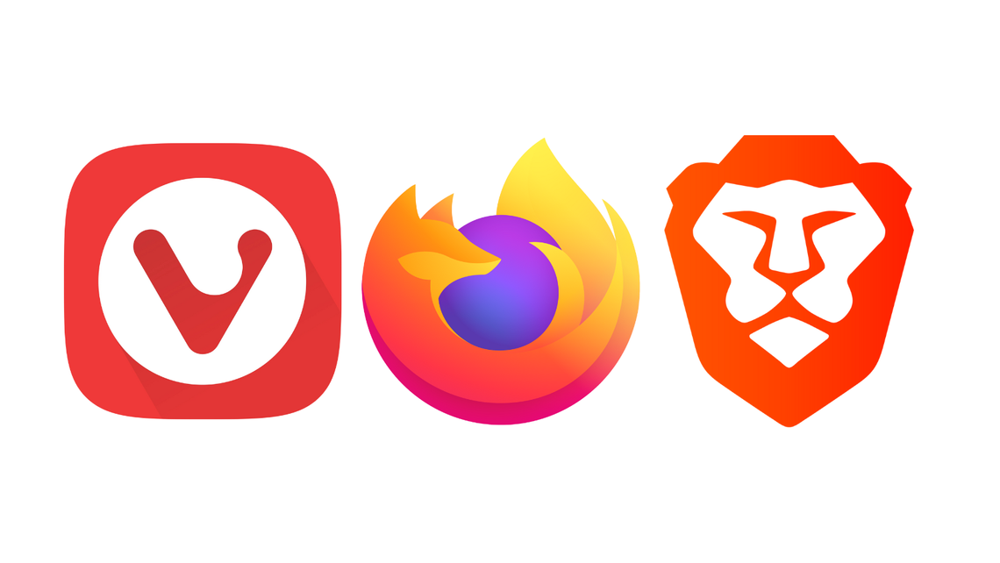

Most people rely on Google Chrome as their go-to browser, but the reality is that Chrome is one of the most privacy-invading browsers available.

While it may be fast and convenient, Chrome thrives on collecting vast amounts of user data, which is used to power Google's advertising business. It tracks your searches, browsing history, and even your location — information that gets sold to advertisers and third-party companies.

But why should everyday users care about their online privacy and security?

In an era where data is currency, protecting your personal information has never been more important.

You may think, "I have nothing to hide," but that’s not the point. Online privacy isn’t just about hiding illegal or unethical activity; it's about safeguarding your right to control your own information.

Your data is valuable, and when it’s in the wrong hands, it can lead to identity theft, financial fraud, and even manipulation.

The good news is, you don’t have to stick with Chrome.

There are other browsers out there designed specifically to protect your privacy.

Here are three excellent alternatives that can help you stay secure online:

## Firefox

Firefox is an open-source browser that puts privacy at the forefront of its design.

Unlike Chrome, Firefox’s source code is public, meaning anyone can review it for security flaws or hidden features, ensuring it’s transparent and safe.

Firefox’s Enhanced Tracking Protection blocks third-party trackers by default, meaning advertisers and websites won’t be able to monitor your activity as you browse. This includes blocking fingerprinting, a technique that identifies your unique browser settings to track you across the web.

Beyond that, Firefox offers robust customization options, letting you tweak its privacy settings to suit your specific needs. Whether you want to block cookies or prevent websites from tracking your location, Firefox makes it easy to stay secure online.

You can get Firefox [here](https://www.mozilla.org/en-US/firefox/?ref=joanadvincula.xyz).

## Vivaldi

Vivaldi is a highly customizable browser with a strong focus on privacy.

It comes with a built-in ad blocker and tracker blocker, which not only improves security but also makes web pages load faster.

What makes Vivaldi stand out is the level of control it gives users over their privacy. You can adjust settings for how cookies are handled, block pop-ups, and even turn off WebRTC, which can sometimes expose your IP address.

Vivaldi doesn’t collect any personal data itself, unlike Chrome, making it a more trustworthy choice.

Vivaldi also respects your browsing habits, allowing you to block invasive ads and prevent websites from building profiles on you.

It’s ideal for users who want full control over their online experience without sacrificing security.

You can get Vivaldi [here](https://vivaldi.com/?ref=joanadvincula.xyz).

## Brave

Brave takes a bold approach by blocking ads and trackers automatically, providing an incredibly fast browsing experience while also safeguarding your privacy.

This not only reduces the amount of data websites collect on you but also speeds up page loading times.

Brave goes a step further by integrating Tor, a privacy-focused browsing network that anonymizes your online activity by routing it through multiple servers. This makes it almost impossible for anyone to track your movements across the web.

One of Brave’s most innovative features is its rewards system. While it blocks ads by default, Brave allows users to opt into privacy-respecting ads and earn tokens for their attention. This flips the advertising model on its head, rewarding you instead of exploiting your data.

You can get Brave [here](https://brave.com/?ref=joanadvincula.xyz).

## Why Your Online Privacy Matters
Many people believe that online privacy isn’t a big deal because they “have nothing to hide.” But privacy is not about hiding — it’s about controlling your data and how it’s used.

When you use browsers like Chrome, you give away control over your information, allowing companies to profit from your habits, preferences, and personal details.

In the wrong hands, this data can be used to manipulate you or even lead to more severe consequences like identity theft.

Privacy isn’t just a luxury; it’s a necessity in the digital world, where personal data is valuable and often misused.

By choosing browsers that prioritize privacy, such as Firefox, Vivaldi, and Brave, you take a crucial step in protecting yourself from the growing threats of data collection and surveillance.