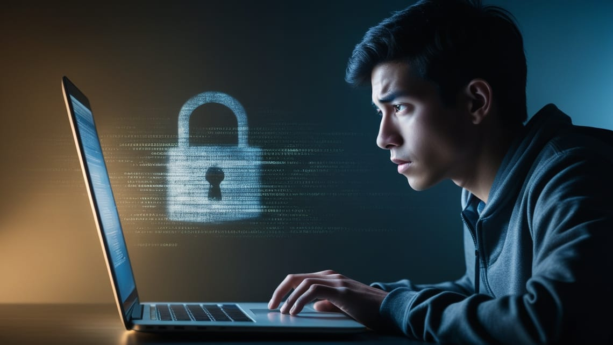

With the world moving online, cyber threats have become part of everyday life, especially for students who use the internet for studying, socializing, and even banking.

Yet, many think of cybercrime as something that exists solely on the "dark web" or in corners of the internet they never visit. But the truth is, cyber threats are pervasive and can affect students in their regular, day-to-day online activities.

From phishing scams to identity theft, this article highlights essential cyber threats every student should be aware of and how to protect themselves effectively.

## 1. Phishing Scams: Tricks to Steal Your Information

Phishing scams are among the most common cyber threats students face. Attackers often send fake emails or messages pretending to be a university, a bank, or even a friend, tricking students into clicking a malicious link or entering sensitive information.

As a student, you’re likely used to receiving emails from school, so it’s easy to miss red flags. A significant percentage of cyber attacks are a direct result of successful phishing attempts. [[1](https://www.itx.ph/insights/navigating-cybersecurity-threats-in-the-philippines-trends-and-challenges?ref=joanadvincula.xyz)] Many scams involve “account verification” emails that request usernames and passwords and many fall for it.

**To stay safe**: Always double-check email senders before clicking links, especially if the email looks unusual or urgent. Enable two-factor authentication (2FA) to secure accounts further, and if you’re unsure, verify the email with the organization directly. Staying alert and skeptical can be your best defenses against phishing attacks.

## 2. Malware and Ransomware: Digital Threats Hidden in Plain Sight

Malware, including ransomware, is malicious software designed to damage or take control of your device. It often hides in downloadable files, websites, or pop-ups, making it especially risky for students who frequently download study materials or browse various sites. Those looking to download free items are especially vulnerable to this type of attack.

Students on shared networks or using personal devices to download educational files are particularly vulnerable. A 2023 report showed that ransomware attacks increased in Southeast Asia, affecting students’ access to vital information and threatening personal data. [[2](https://www.idc.com/getdoc.jsp?containerId=prAP52565924&ref=joanadvincula.xyz)]

**To stay safe**: Avoid downloading files from unknown sources or clicking on ads and pop-ups. Keep your software updated and consider installing a reliable antivirus program. A proactive approach to device security can save you from the severe consequences of malware attacks.

## 3. Social Engineering: When Hackers Exploit Your Trust

Social engineering attacks are more personal than other threats. Hackers might pretend to be someone you trust to manipulate you into giving up information. With so many people sharing personal details on social media, students are particularly susceptible to these scams.

Social media is a big part of student life, and it’s easy to share information that cybercriminals can exploit. For instance, a popular scam in the Philippines involved criminals impersonating friends or family members online to gain financial support or access to accounts .

**To stay safe**: Be mindful of what you post and cautious about friend requests from unknown people. Double-check messages that request personal information, even if they seem to come from someone you know. Sometimes, simply staying aware of these tactics can protect you from social engineering.

## 4. Public Wi-Fi Risks: Convenience Comes at a Cost

Public Wi-Fi is a great convenience, especially for students studying in libraries or cafes, but it comes with risks. Public networks are often unsecured, making it easy for hackers to intercept data.

Many students connect to public Wi-Fi daily without realizing that these networks can expose them to cyber threats. Cybercriminals use public networks to launch attacks, especially in busy areas like university hubs. [[3](https://cybernews.com/privacy/risks-of-unencrypted-internet-traffic/?ref=joanadvincula.xyz)]

**To stay safe**: Use a trusted and verified Virtual Private Network (VPN) to encrypt your data when using public Wi-Fi, and avoid logging into sensitive accounts. Disable automatic Wi-Fi connections to prevent your device from joining unsecured networks without your knowledge. Staying cautious can help you stay safe when on the go.

## 5. Identity Theft: Guarding Your Digital Identity

Identity theft is when someone steals your personal information to commit fraud. This can have long-lasting impacts, from financial loss to reputational damage, making it a severe concern for students.

Students are common targets for identity theft, as they often have clean credit histories and sometimes lack awareness about securing personal information. In the Philippines, identity theft cases are on the rise, with many students falling victim due to exposed personal details on social media. [[4](https://newsinfo.inquirer.net/1898085/identity-theft-scams-via-socmed-on-the-rise?ref=joanadvincula.xyz)]

**To stay safe**: Be careful of what you share online and monitor your financial apps. Staying vigilant about your personal information is crucial in preventing identity theft and protecting your future.

## 6. Data Privacy and Your Online Footprint: More Than Just ‘Nothing to Hide’

The phrase “I have nothing to hide” is common, but it’s misleading. Online privacy is about control over your personal information, not about hiding illegal activities. Data is valuable, and tech companies often collect it without users fully realizing its potential uses.

In the Philippines, increasing digital transactions and online interactions make data privacy more critical than ever. Students, who often rely on social media and digital financial services like GCash, should know how their information is used and why it matters .

**To stay safe**: Regularly review your accounts and be selective about app permissions. Consider privacy-focused browsers and search engines that reduce data tracking. Protecting your digital footprint is vital, not just for security but also for personal autonomy.

---

Cyber threats extend far beyond the dark web, affecting students daily in ways many may not realize.

Staying safe online doesn’t require expert knowledge; it simply means being cautious, informed, and proactive about personal cybersecurity.

By following these simple tips, you can enjoy a safer, more secure online experience and protect your digital life from the evolving landscape of cyber threats.
