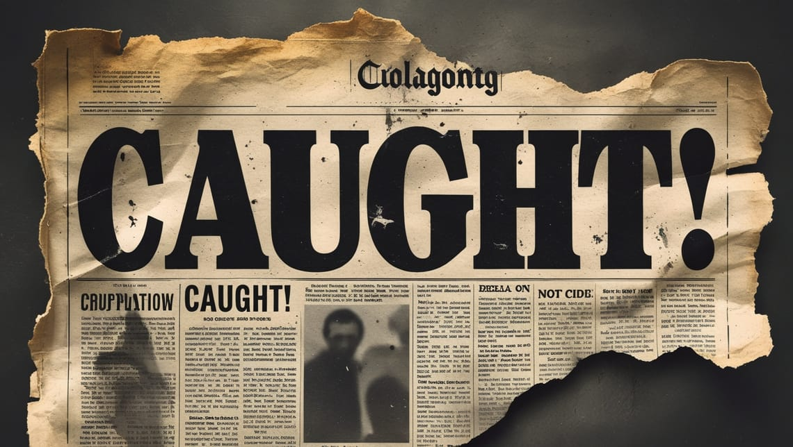

Serial killers horrify us — but they also captivate us. From watching true crime documentaries to devouring books about infamous murderers, society's fascination with serial killers is undeniable. But why? What is it about these criminals that keeps us glued to our screens, eager to learn every chilling detail?

Psychologists, criminologists, and media experts have studied this obsession for years. The reasons range from a natural curiosity about danger to the way media sensationalizes these crimes. Understanding why we're drawn to serial killers can help us recognize the fine line between learning about crime and glorifying it.

## The Neuroscience of Fear and Fascination

Fear is a survival mechanism. When we hear about a serial killer, our brains naturally become alert. This reaction is linked to our evolutionary past, where being aware of potential threats was essential for survival. However, in today's world, we can experience fear in a controlled environment — watching documentaries, reading crime stories, or listening to true crime podcasts — without actual danger.

Neuroscientist Dean Burnett explains that consuming content about serial killers can stimulate the release of cortisol (a precursor to adrenaline) and activate the brain's reward system (Hankinson, 2017). This creates a cycle of fear and relief that keeps audiences hooked. When we feel threatened while reading about a serial killer and then stop, our brain rewards us for removing ourselves from the perceived threat, reinforcing our interest in the subject.

This concept is similar to why people love horror movies. **We enjoy the adrenaline rush that fear provides, but only because we know we're safe.** Serial killer stories offer this same psychological thrill, allowing us to explore the darkest corners of human nature from a distance.

According to research from Magdalen (2023), morbid curiosity plays a role in our obsession with serial killers. We want to understand what makes them different from the rest of society. Are they born evil? Do they have a psychological disorder? These questions make us eager to analyze every detail of their crimes and behaviors.

## "Wound Culture" and Confronting the Unimaginable

Criminologist Elizabeth Yardley describes our attraction to true crime as "wound culture" — we're drawn to the trauma and suffering of others in ways that date back throughout human history (Hankinson, 2017). It's the same impulse that makes people slow down to look at car accidents or watch videos of disasters.

Part of this compulsion stems from our attempt to imagine the unimaginable. When we learn about a person being harmed in a seemingly normal house while the killer later goes shopping like any ordinary person, it creates a cognitive dissonance that our brains try to resolve. **This unsettling juxtaposition generates a peculiar feeling that, while uncomfortable, draws us in as we try to make sense of it.**

## The Mystery of the Criminal Mind

Serial killers are not ordinary criminals. They often have high intelligence, manipulative skills, and the ability to evade law enforcement for years. This makes them a mystery — one that people are eager to solve.

Take the case of Ted Bundy, who tricked his victims into thinking he was a harmless man needing help. His ability to deceive people made his crimes even more terrifying, and the public became fixated on understanding how he could be so charismatic yet so deadly.

Even in the Philippines, people have been drawn to cases like Juan Severino Mallari, one of the country's earliest recorded serial killers. He was a priest who murdered multiple victims in the early 1800s, making his story both shocking and historically significant.

The public's desire to "solve" these cases and understand the minds of serial killers fuels the ongoing obsession. **We want to believe that if we study them enough, we can recognize and prevent similar crimes in the future.**

## The "Hidden Monster" Effect

What makes serial killers particularly fascinating is what could be called the "hidden monster" effect — their ability to appear completely normal while harboring murderous impulses (Bond, 2016). James Hoare, editor of *Real Crime* magazine, notes that they embody the idea that "something nasty is out there," which taps into our primal fears.

Jeffrey Dahmer was considered unthreatening by police, and John Wayne Gacy was a respected community member who dressed as a clown at children's parties (Bond, 2016). **This juxtaposition of horror and humanity creates a psychological puzzle that captivates our attention.**

Criminologist Elizabeth Yardley explains: "Serial killers are like chameleons in that they can blend into normal everyday life, they look like average guys and some of them are even quite charming. They don't look like the predatory monsters that we see in the movies, so there's this idea that they could be your neighbor, they could be anybody and you wouldn't know, and so there's that undercurrent of fear" (Hankinson, 2017).

## Psychological Profiles and Patterns

Many serial killers have experienced adverse childhood experiences, such as abuse, neglect, or witnessing violence. According to Magdalen (2023), these early traumas can contribute to the development of psychopathology and shape the distorted worldview and social detachment exhibited by serial killers.

Power and control often drive their actions, as serial killers derive a sense of dominance and superiority from exerting power over their victims. Some killers may also be motivated by sexual gratification, with sexual fantasies and paraphilic interests intertwined with their acts of violence (Magdalen, 2023).

Fantasies play a significant role in the lives of serial killers. These fantasies provide an outlet for their inner desires and can escalate in intensity over time. Serial killers often engage in a process of "fantasy reinforcement," where their violent thoughts become more elaborate and consuming, eventually leading to the actualization of their fantasies through murder.

## The Role of Media in Serial Killer Obsession
The media plays a huge role in shaping public perception of serial killers. True crime documentaries, movies, and books often focus on the criminals rather than their victims. Some criminals even gain cult-like followings, with people writing letters to them in prison or collecting memorabilia related to their crimes.

The template for this media fascination was established with Jack the Ripper. The 19th-century East End murders had all the elements of contemporary serial killer fascination: huge press coverage, gruesome details, speculation, a focus on the murderer rather than the victims, a nickname for the killer, and the dynamic of a mysterious, clever murderer who was supposedly toying with the public and the police (Hankinson, 2017).

Professor Alexandra Warwick, an expert on Jack the Ripper, notes that our perception of serial killers has been significantly influenced by fiction. She argues that the notion of "a titanic struggle between two individuals — the clever serial killer and his mirror image in the police officer" is "entirely the product of fiction" (Hankinson, 2017). In reality, serial killers are far less elaborate and organized than their fictional counterparts.

One reason for this disconnect is storytelling. The media presents serial killers as complex, larger-than-life figures. Whether it's Netflix's documentaries on Jeffrey Dahmer or films about the Zodiac Killer, the way these stories are told can make these criminals seem almost like fictional characters rather than real people who caused immense suffering.

## From Whodunit to Whydunit

Our fascination with serial killers has evolved over time. According to Yardley, "We used to be quite obsessed with the whodunit question — who is it that committed all of these murders? But now we're much more preoccupied with whydunit—why would somebody do this?" (Hankinson, 2017). We want to understand what happened in their lives, what caused their behavior, whether their brains function differently, and how they differ from us.

This shift reflects a deeper psychological truth: **our interest in why others commit heinous acts is ultimately an interest in understanding ourselves**. As Professor Warwick explains, "Being interested in why other people do things is always being interested in what we're like ourselves... Are we capable of those things?" (Hankinson, 2017). This self-reflection adds another layer to our fascination with serial killers.

## The Reality Behind the Myth

Despite the media attention and public fascination, serial killers are statistically rare. According to criminologist David Wilson, there have only been a few dozen serial killers in the UK since Jack the Ripper. In the United States, criminologist Scott Bonn estimates that only about 150 people are killed by serial killers each year—less than one percent of the total number of murders in the country (Hankinson, 2017).

**The mythologizing of serial killers has distorted our perception of them.** Criminologist Elizabeth Yardley admits that like many, she was first introduced to serial killers through films like *The Silence of the Lambs*, which portrayed them as monstrous and intriguing. However, after studying them academically, she found that "they're boring, dull individuals, who aren't really anything like the movie figures" (Hankinson, 2017).

Professor Warwick is even more blunt: "They're not interesting at all" (Hankinson, 2017).

## The Ethics of Our Fascination

While studying serial killers can help criminologists and law enforcement understand criminal behavior, the way we consume these stories matters. **It's important to remember that behind every serial killer is a trail of victims whose lives were cut short.** Their stories deserve attention just as much as the crimes themselves.

The psychological toll of engaging with these dark materials can be significant. Author Gordon Burn, who wrote about the infamous Fred and Rose West case, experienced terrible nightmares during his research. He would "come back from Gloucester, fall asleep in front of the television and wake up screaming" (Hankinson, 2017). After completing the book, he went through several nights where he "went to bed and just couldn't stop shaking." The experience was so traumatic that he vowed never to write about such subjects again, feeling that it had "taken something away from me that I can't get back" (Hankinson, 2017).

Furthermore, the glamorization of serial killers can have real-world consequences. Some individuals develop an unhealthy obsession with these criminals, even idolizing them. Others may be inspired to commit copycat crimes.

**A responsible approach to true crime media includes remembering the victims, analyzing the systemic failures that allowed these criminals to operate, and using the knowledge gained to improve crime prevention.**

## Confronting Our Collective Shadow

Our fascination with serial killers is deeply rooted in neuroscience, psychology, storytelling, and human curiosity. The interplay between fear and reward in our brains, our evolutionary drive to understand threats, and our cultural obsession with mystery all contribute to this enduring interest.

While it's natural to be interested in crime, we must balance this curiosity with ethical considerations. By shifting the focus from glorifying serial killers to understanding the societal factors that contribute to crime, we can turn our interest into something productive—one that helps prevent future tragedies rather than sensationalizing past ones.

Through responsible engagement with the subject, we can learn valuable lessons about criminal psychology, victimology, and the effectiveness of our justice system, while always remembering the human cost behind these notorious cases.

---

## References

- Bond, M. (2016, March 31). Why are we eternally fascinated by serial killers? BBC Future. [https://www.bbc.com/future/article/20160331-why-are-we-eternally-fascinated-by-serial-killers](https://www.bbc.com/future/article/20160331-why-are-we-eternally-fascinated-by-serial-killers)
- Hankinson, A. (2017, November 20). This is why are we all so obsessed with serial killers. ShortList. [https://www.shortlist.com/news/serial-killers-obsession-posterboys-charles-manson-psychology](https://www.shortlist.com/news/serial-killers-obsession-posterboys-charles-manson-psychology)
- Magdalen, C. (2023). The psychology of serial killers: Unraveling the minds of notorious criminals. Addiction & Criminology, 6(4), 163. [https://www.alliedacademies.org/articles/the-psychology-of-serial-killers-unraveling-the-minds-of-notorious-criminals-26136.html](https://www.alliedacademies.org/articles/the-psychology-of-serial-killers-unraveling-the-minds-of-notorious-criminals-26136.html)
