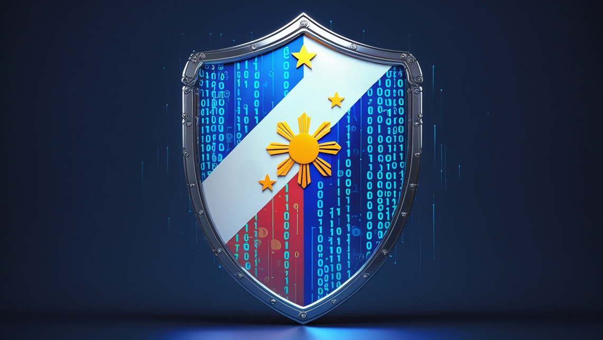

In today's interconnected world, your personal information is constantly being collected, stored, and processed. From GCash transactions to food delivery apps, your data is everywhere — but is it truly secure? The **Data Privacy Act of 2012** (Republic Act No. 10173) stands as your shield against misuse of personal information, but many Filipinos remain unaware of their rights and the protections available to them.

Let's explore what this means for you and your digital footprint.

## Understanding the Data Privacy Act: Your Digital Shield

The Data Privacy Act (DPA) of 2012 isn't just another law—it's your personal guarantee that organizations must handle your data responsibly. As a Filipino citizen, you have specific rights under this law:

- **Right to be informed** when your data is being collected and how it will be used
- **Right to access** your personal information that organizations hold
- **Right to correct** inaccuracies in your data
- **Right to object** to certain types of data processing
- **Right to erasure** when your data is no longer needed for its original purpose

The law places special protections around sensitive personal information, including your health records, financial data, and biometric details—information that could cause significant harm if compromised.

## Real-World Impact: When Companies Fail to Protect Your Data

In 2018, the National Privacy Commission (NPC) investigated a major data breach affecting Jollibee Foods Corporation (JFC), one of the Philippines' largest fast-food chains. The breach exposed the personal information of approximately 11 million customers who had registered on the company's online ordering website. The compromised data included names, addresses, contact numbers, and birth dates—information that could be used for identity theft and targeted scams.

The NPC found that JFC had failed to implement appropriate security measures to protect customer data. Despite having been aware of vulnerabilities in their system, the company had not acted promptly to address these issues. This negligence highlighted the real-world consequences of inadequate data protection protocols, especially for companies handling large volumes of personal information.

As a result of this investigation, the NPC ordered JFC to implement a comprehensive data protection program, conduct regular security assessments, and appoint a dedicated Data Protection Officer. The company also faced significant reputational damage and loss of customer trust. This case set an important precedent for how the NPC would enforce the Data Privacy Act and demonstrated that even large, established companies are not exempt from the law's requirements.

## What Organizations Must Do to Protect Your Information

For businesses handling your data, compliance isn't optional—it's mandatory. Organizations must:

- Implement robust security measures like encryption and access controls
- Notify the National Privacy Commission and affected individuals within 72 hours of a data breach
- Establish clear data retention policies
- Hold third-party service providers accountable for data protection

Failure to comply can result in penalties of up to ₱5 million and imprisonment of up to six years for responsible individuals.

## Taking Control: Protecting Your Digital Identity

While the law provides protections, you also play a crucial role in safeguarding your data:

1. **Review privacy settings on your social media accounts and mobile apps** Take time to thoroughly check the privacy settings on platforms like Facebook, Instagram, and TikTok. Most apps have granular controls that let you decide who sees your posts, who can contact you, and what information is shared with third parties. Schedule a "privacy checkup" every few months to ensure your settings haven't been reset during updates.

2. **Use strong, unique passwords for different accounts** Create complex passwords that combine uppercase and lowercase letters, numbers, and special characters. Avoid using easily guessable information like birthdays or names. Consider using a password manager like Bitwarden to generate and store unique passwords for each of your accounts, eliminating the need to remember them all.

3. **Enable two-factor authentication when available** Add an extra layer of security by enabling two-factor authentication (2FA) on your important accounts. This requires not only your password but also a second form of verification—usually a code sent to your phone or generated by an authenticator app. Even if someone obtains your password, they won't be able to access your account without this second factor.

4. **Be cautious about sharing personal information online** Think twice before sharing your full name, address, phone number, or ID numbers online. Be particularly careful with information that could be used to answer security questions, such as your mother's maiden name or the name of your first pet. Remember that posts on social media can often be viewed by more people than you intend.

5. **Regularly check for unauthorized access to your accounts** Monitor your accounts for suspicious activity, such as logins from unfamiliar locations or devices. Many services offer account activity logs that you can review. For financial accounts, review statements regularly and report any unauthorized transactions immediately. Consider setting up alerts for account activity to be notified of potential breaches in real-time.

## What to Do If Your Data Rights Are Violated

If you believe an organization has mishandled your personal information, you can:

1. Contact the organization directly to address your concerns.
2. File a complaint with the National Privacy Commission through their website at privacy.gov.ph.
3. Seek legal advice if necessary.

## Strengthening Your Digital Armor: Proposed Amendments

As cyber threats evolve, so too must our laws. Several amendments to the DPA have been proposed to enhance protection:

- **House Bill No. 892**: Aims to impose stricter penalties—including longer imprisonment terms and higher fines—for violations
- **House Bill No. 898**: Seeks to expand the definition of sensitive data to include biometric and genetic information
- **Senate Bill No. 1367**: Proposes exemptions for data processing during health emergencies, balancing privacy with public health needs

These amendments reflect the government's commitment to keeping pace with technological advancements and emerging threats.

## Your Data, Your Future

The Data Privacy Act provides a solid foundation for protecting personal information in the Philippines, but staying informed and vigilant is essential. By understanding your rights and the responsibilities of data handlers, you can better navigate the digital landscape and protect what matters most—your privacy.

Remember: **In the digital age, your data is an extension of yourself. Protect it accordingly.**

---

## References

- DLA Piper. (n.d.). Data Privacy Act of 2012 – The Philippines. Retrieved from [https://www.dlapiperdataprotection.com/?t=law&c=PH](https://www.dlapiperdataprotection.com/?t=law&c=PH)
- Inquiro. (n.d.). What is Data Privacy Act? A Briefer. Retrieved from [https://inquiro.ph/what-is-data-privacy-act-a-briefer/](https://inquiro.ph/what-is-data-privacy-act-a-briefer/)
- National Privacy Commission. (n.d.-a). The Data Privacy Act and Its Implementing Rules and Regulations. Retrieved from [https://privacy.gov.ph/data-privacy-act/](https://privacy.gov.ph/data-privacy-act/)
- Republic Act No. 10173. (2012). Data Privacy Act of 2012. National Privacy Commission. [https://privacy.gov.ph/data-privacy-act/](https://privacy.gov.ph/data-privacy-act/)
- Sangfor. (n.d.). Jollibee data breach in the Philippines affected 11 million customers. Sangfor Blog. Retrieved from [https://www.sangfor.com/blog/cybersecurity/jollibee-data-breach-philippines-affected-11-million-customers](https://www.sangfor.com/blog/cybersecurity/jollibee-data-breach-philippines-affected-11-million-customers)
- SecurePrivacy. (n.d.). Data Privacy Act 2012 Philippines Guide. Retrieved from [https://secureprivacy.ai/blog/data-privacy-act-2012-philippines-guide](https://secureprivacy.ai/blog/data-privacy-act-2012-philippines-guide)
