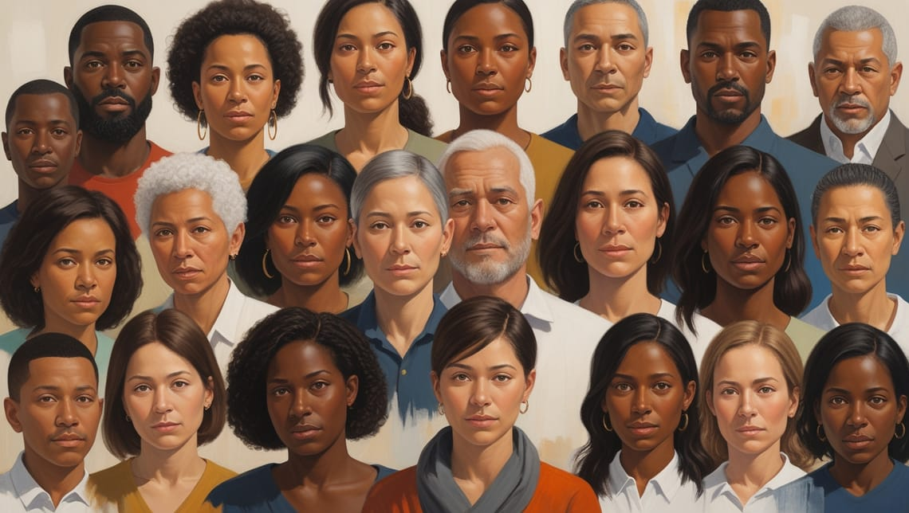

When we discuss crime, our attention typically centers on perpetrators, their motives, and the legal consequences they face. However, an equally important — yet frequently neglected — area of inquiry is ***victimology***.

This discipline examines victimization in all its facets, including the psychological effects on victims, the relationships between victims and offenders, and how victims navigate the criminal justice system and society at large (Alliant International University, n.d.).

Crucially, victimology isn't about assigning blame to victims; it's a scientific study aimed at understanding and supporting those who have experienced crime.

## The Foundations of Victimology

Victimology emerged as a specialized area within criminology in the mid-20th century, propelled by pioneering research that shifted focus toward victims' experiences. Benjamin Mendelsohn, often considered the "father of victimology," introduced the term in the 1940s while studying the relationship between victims and offenders.

His work marked a significant shift towards examining victims' experiences, which led to increased sympathy for victims and contributed to important social movements like the Women's Movement and Civil Rights Movement (Alliant International University, n.d.). This evolution helped establish victimology as a distinct academic discipline that recognizes the profound impact of victimization on individuals and society.

The need for victimology has grown increasingly apparent throughout the country as we grapple with unique crime patterns influenced by socioeconomic factors, geographical challenges across our 7,641 islands, and distinct cultural dynamics that affect how victims report crimes and seek support.

## Key Dimensions of Victimology

### Victim-Offender Relationships

One central aspect of victimology is the analysis of victim-offender dynamics.

This examination investigates how victims and offenders knew each other and the nature of their interactions leading to the crime (SIFS, n.d.). Research consistently shows that many crimes involve people who know each other—whether family members, acquaintances, or those in professional relationships.

These relationships often have additional layers of complexity due to strong Filipino family ties, community interconnectedness, and cultural values like "hiya" (shame), "utang na loob" (indebtedness), and "pakikisama" (getting along with others). These cultural factors can significantly influence whether victims report crimes, especially when perpetrators are family members or community figures.

### Victimization Patterns and Risk Factors
Victimologists study patterns to identify who is most vulnerable to certain types of crimes. By understanding why certain individuals or groups are targeted more frequently, victimology helps develop strategies to decrease vulnerabilities, improve public safety, and raise crime awareness (SIFS, n.d.). Research reveals that victimization isn't randomly distributed across populations. Factors such as age, socioeconomic status, geographic location, and previous victimization can significantly influence risk.

For communities in densely populated urban areas like Metro Manila, Cebu, and Davao, or in conflict-affected regions in Mindanao, understanding these risk patterns is essential for developing effective crime prevention strategies tailored to local contexts.

### Psychological Impact and Trauma
Victimologists study the impact of crime on victims, including traumatic effects, responses to victimization, and coping mechanisms for healing and recovery (Office of Justice Programs, 2000).

The psychological consequences of victimization often extend far beyond the immediate aftermath of a crime. Victims may experience a range of responses including post-traumatic stress disorder (PTSD), depression, anxiety, changes in worldview, and disrupted relationships.

Mental health support for crime victims remains limited throughout much of the country, particularly outside major urban centers.

### Legal and Social Implications
The field explores how victims are treated after a crime occurs, including their interactions with law enforcement, legal processes, and media coverage (SIFS, n.d.). Victimology scrutinizes the treatment of victims within the legal system and broader society, examining how perceptions by law enforcement, the courts, the media, and the public influence victims' access to justice.

These concerns are particularly relevant given ongoing justice sector reforms and various initiatives by the Department of Justice and Supreme Court to improve access to justice for all Filipinos.

## Theoretical Frameworks in Victimology
Several influential theories help explain victimization:

**Mendelsohn's Theory of Victimization**

One of the earliest theories in victimology, Benjamin Mendelsohn's work categorizes victims into six typologies based on their perceived level of responsibility in the crime (Daigle & Muftic, 2019). This framework provides a structure to analyze victims' experiences without necessarily assigning blame.

**Deviant Place Theory**

This theory suggests that the location of a crime is crucial to victimization, focusing on environmental factors rather than victim characteristics (Karmen, 2019). It emphasizes how certain areas may have higher crime rates due to factors like poor lighting, limited surveillance, or social disorganization.

This theory helps explain why certain barangays experience higher crime rates and why community-based policing efforts and the Barangay Justice System play crucial roles in addressing localized crime patterns.

**Lifestyle and Routine Activities Theories**

These related theories suggest that victimization occurs when three elements converge: a motivated offender, a suitable target, and the absence of capable guardians. People's daily routines and lifestyle choices can increase or decrease their exposure to these criminogenic situations.

For many Filipino workers, particularly those with long commutes on public transportation, working night shifts, or living in informal settlements, these theories offer insights into developing practical safety strategies within the realities of daily life.

** Structural Victimization Theories**

These approaches examine how social structures and inequalities contribute to victimization. Where significant socioeconomic disparities exist, these theories help explain why certain populations — including informal settlers, indigenous communities, and those in conflict-affected areas—may face heightened risks of victimization due to systemic factors beyond individual control.

## Victimology in Practice

### Role of Victimologists

Victimologists play crucial roles in the criminal justice system, including:

- Assisting with criminal investigations
- Developing victim assistance programs
- Researching issues like repeat victimization
- Creating prevention strategies for secondary victimization
- Advocating for victims' rights and dignity in court proceedings (SIFS, n.d.)

Locally, this work is often carried out by professionals in various sectors, including social workers with the Department of Social Welfare and Development (DSWD), psychologists, criminologists, and NGO advocates working with specific victim populations.

### Victim Services and Support

One of victimology's most significant contributions has been the development of comprehensive victim support services.

Services like the PNP Women and Children Protection Desks, DSWD's Crisis Intervention Units, and the Inter-Agency Council Against Trafficking (IACAT) apply victimological principles in their work, though challenges in coordination and resource allocation remain.

### Restorative Justice

Victimology has influenced the growing restorative justice movement, which focuses on repairing harm rather than simply punishing offenders. The Office of Justice Programs (2000) notes that victimology is essential for the rehabilitation of offenders and their eventual reintegration into society.

Filipino indigenous traditions of community-based conflict resolution, such as the "tongtongan" practice in the Cordilleras and similar systems in other cultural groups, often align with restorative justice principles and could be strengthened through integration with formal victimology-informed practices.

### Criminal Justice Reform
Insights from victimology have driven significant reforms in the national criminal justice system, including Republic Act 9262 (Anti-Violence Against Women and Their Children Act), Republic Act 11648 (Expanded Anti-Violence Against Women and Their Children Act), and the establishment of family courts designed to be more sensitive to victims' needs.

## Contemporary Challenges in Victimology

**Digital Victimization**

As technology use expands nationwide, new forms of victimization have emerged. With internet penetration reaching over 67% of the population and Filipinos being among the world's highest users of social media, cyberbullying, online scams, and technology-facilitated abuse present significant challenges that require specialized victimological approaches.

**Hidden Victims**

Some victim populations remain underrepresented in local research and services. These include male victims of sexual violence, elderly victims of abuse, members of the LGBTQ+ community facing hate crimes, and victims of human trafficking. Cultural taboos and stigma often prevent these groups from seeking help or being properly identified by authorities.

**The Victim-Offender Overlap**

Research consistently shows significant overlap between victim and offender populations, particularly for violent crimes. This is especially relevant when examining issues like involvement in drug-related crimes, where many offenders have histories of victimization themselves, highlighting the complex relationship between experiencing and perpetrating harm.

## The Future of Victimology

As the field continues to evolve within our unique cultural landscape, several promising directions emerge:

- **Building local research capacity** to develop Filipino-specific victimology data rather than relying primarily on studies from Western contexts
- **Integrating cultural competence** into victim services that respect local values while addressing harmful cultural practices that may impede victims' recovery
- **Strengthening the Barangay Justice System** with victimology-informed approaches that balance community harmony with victims' needs
- **Developing trauma-informed protocols** for law enforcement, healthcare workers, and judiciary personnel

## Why Victimology Matters to Filipino Society

Victimology is now considered an essential component of the criminal justice system, crucial for crime prevention and ensuring proper support for survivors (Alliant International University, n.d.). For a country with a unique cultural landscape, socioeconomic challenges, and ongoing justice system reforms, victimology offers vital insights that can help create more effective, compassionate responses to crime.

For Filipino criminology students, understanding victimology is essential for developing approaches that reflect local realities while incorporating global best practices. For practitioners across the justice system, from police officers to social workers, victimological knowledge enables more effective and empathetic interventions.

Perhaps most importantly, victimology reminds us that **behind every crime statistic are real people with unique experiences who deserve both understanding and support**. By continuing to develop this field within our cultural context, we move toward a criminal justice system that truly serves all stakeholders — including those most directly harmed by crime.

---

## Reflection

1. How might understanding victimology change public perceptions of crime victims in Filipino society?
2. In what ways could victim-offender mediation benefit or potentially harm victims within our cultural context?
3. How should victimological research inform crime prevention strategies in your local barangay?

---

## References

- Alliant International University. (n.d.). *What is victimology?* Retrieved March 17, 2025, from [https://www.alliant.edu/blog/what-is-victimology](https://www.alliant.edu/blog/what-is-victimology)
- Daigle, L. E., & Muftic, L. R. (2019). *Victimology: A comprehensive approach*. SAGE Publications.
- Karmen, A. (2019). *Crime victims: An introduction to victimology* (10th ed.). Cengage Learning.
- Office of Justice Programs. (2000, December). *The vital role of victimology in the rehabilitation of offenders and their eventual reintegration into society*. National Criminal Justice Reference Service. Retrieved March 17, 2025, from [https://www.ojp.gov/ncjrs/virtual-library/abstracts/vital-role-victimology-rehabilitation-offenders-and-their](https://www.ojp.gov/ncjrs/virtual-library/abstracts/vital-role-victimology-rehabilitation-offenders-and-their)
- SIFS. (n.d.). *Role of victimology in studying crimes*. SIFS India. Retrieved March 17, 2025, from [https://www.sifs.in/blog-details/role-of-victimology-in-studying-crimes](https://www.sifs.in/blog-details/role-of-victimology-in-studying-crimes)
