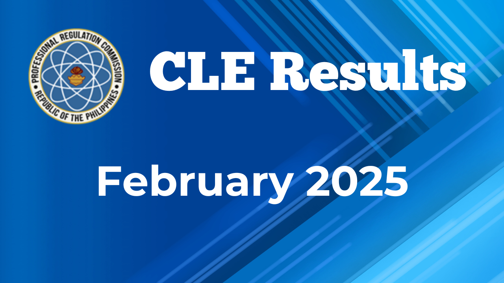

The Professional Regulation Commission (PRC) announced on March 7, 2025, that **22,245 out of 36,768 examinees (60.5% passing rate)** successfully passed the February 2025 Licensure Examination for Criminologists. The three-day examination was conducted on February 5-7, 2025, across 29 testing centers nationwide. Results were released after a twenty-working-day evaluation period following the examination's conclusion.

The Board of Criminology recognized the following top-performing candidates:

1. **John Michael Bundalian Amio** (Holy Angel University) - 92.20%
2. **Christopher Pachico** (Kolehiyo ng Lungsod ng Lipa) - 91.90%
3. **Franz Jury Pacaldo Insao** (University of the Visayas – Cebu City) - 91.85%
4. **Aiko Bangcat Eso** (Negros Oriental State University – Siaton) - 91.80%
5. **Aron Edwell Escobañas Argosino** (Laguna State Polytechnic University – Siniloan) - 91.70%
**John Kenneth Cabsag Santos** (University of Batangas – Lipa) - 91.70%
6. **Theodore Ngayud Domoguen** (University of Baguio) - 91.65%
**Alexis John Isaiah Endrinal Medina** (Isabela State University – Echague) - 91.65%
7. **Precious Manipon Purugganan** (Don Mariano Marcos Memorial State University – San Fernando) - 91.60%
**Mark Renz Mangahas Resurreccion** (Colegio de San Gabriel Archangel) - 91.60%
8. **Kathleen Jane Modesto Latimban** (Holy Trinity College of General Santos City) - 91.45%
**Leonel Villarta Martinez** (University of Luzon) - 91.45%
9. **Camar Ariong Intia** (Mindanao Institute of Technology, Inc.) - 91.40%
**Hasraf Imam Lidasan** (University of Perpetual Help System Dalta – Las Piñas) - 91.40%
**Shella Mae Dupo Salibio** (Bago City College) - 91.40%
10. **Jamjameen Uy Alang** (Taguig City University) - 91.35%

The successful examinees may check the PRC website for registration requirements and schedule for the issuance of their Professional Identification Cards and Certificates of Rating.

The next Criminology Licensure Examination is expected for August 2025. Registration details will be available on the PRC's official portal in the coming months.

This latest batch of licensed criminologists joins the ranks of professionals helping to strengthen law enforcement and criminal justice initiatives throughout the Philippines.

For complete examination results and additional information, interested parties may visit the PRC's official website at [www.prc.gov.ph](https://www.prc.gov.ph/).

---

**Reference** Professional Regulation Commission. (2025, March 7). *February 2025 licensure examination for criminologists results released twenty (20) working days*. [https://www.prc.gov.ph/article/february-2025-licensure-examination-criminologists-results-released-twenty-20-working-days](https://www.prc.gov.ph/article/february-2025-licensure-examination-criminologists-results-released-twenty-20-working-days)
