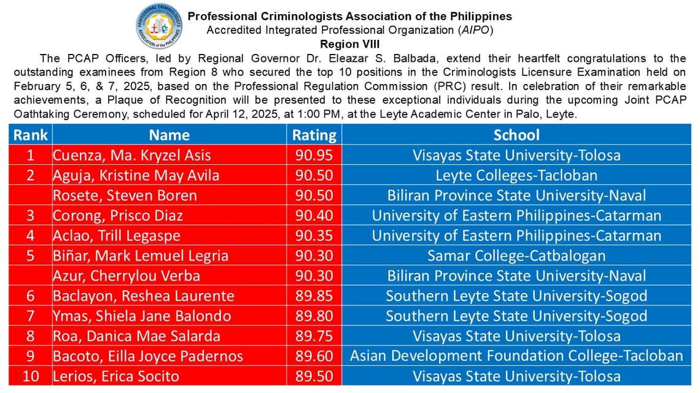

The Professional Criminologists Association of the Philippines (PCAP), Region VIII, announced on March 25, 2025 the regional top performers of the February 2025 Licensure Examination for Criminologists, which was conducted from February 5 to 7, 2025, through an official recognition on the PCAP R8 Facebook page.

The top performers, representing six different educational institutions in Region VIII, demonstrated exceptional academic achievement in the criminology licensure exam. Their success not only highlights individual excellence but also reflects the strong criminology programs in the region's universities and colleges.

Top Performers:

1. **Cuenza, Ma. Kryzel Asis** | 90.95% | Visayas State University – Tolosa | Tolosa, Leyte
2. **Aguja, Kristine May Avila** | 90.50% | Leyte Colleges | Tacloban City
**Rosete, Steven Boren** | 90.50% | Biliran Province State University | Naval, Biliran
3. **Corong, Prisco Diaz** | 90.40% | University of Eastern Philippines | Catarman, Northern Samar
4. **Aclao, Trill Legaspe** | 90.35% | University of Eastern Philippines | Catarman, Northern Samar
5. **Biñar, Mark Lemuel Legria** | 90.30% | Samar College | Catbalogan, Samar
**Azur, Cherrylou Verba** | 90.30% | Biliran Province State University | Naval, Biliran
6. **Baclayon, Reshea Laurente** | 89.85% | Southern Leyte State University | Sogod, Southern Leyte
7. **Ymas, Shiela Jane Balondo** | 89.80% | Southern Leyte State University | Sogod, Southern Leyte
8. **Roa, Danica Mae Salarda** | 89.75% | Visayas State University – Tolosa | Tolosa, Leyte
9. **Bacoto, Eilla Joyce Padernos** | 89.60% | Asian Development Foundation College | Tacloban City
10. **Lerios, Erica Socito** | 89.50% | Visayas State University – Tolosa | Tolosa, Leyte

To commemorate these outstanding achievements, PCAP Region VIII will honor these top performers during the upcoming Joint PCAP Oathtaking Ceremony. Scheduled for April 12, 2025, at 1:00 PM at the Leyte Academic Center in Palo, Leyte, the event will feature a formal recognition and presentation of Plaques of Recognition to these exceptional criminology graduates.

By highlighting these achievements, PCAP Region VIII reinforces the importance of academic rigor and professional competence in the field of criminology. The official announcement provides a platform to celebrate these students' remarkable accomplishments and inspire future criminology professionals.

For more information, visit the PCAP R8 Professional Criminologists Association of the Philippines Facebook page.

---

Source: PCAP R8 Professional Criminologists Association of the Philippines, [post on 2025 March 25, 12:04 PM](https://www.facebook.com/permalink.php?story_fbid=pfbid027nUJjfJgxFPEfMYmUa9WusubQrjkPzv2Dybm8r6H4rNow9qpDQWAZNMTScxcVLb2l&id=100084442635643)