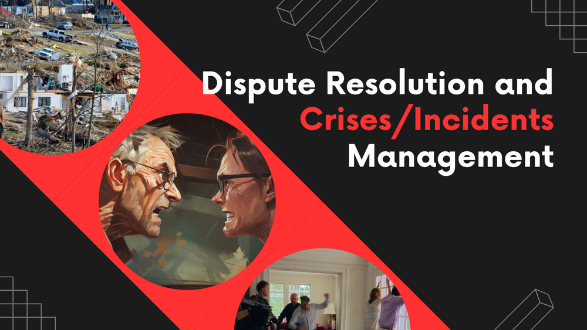
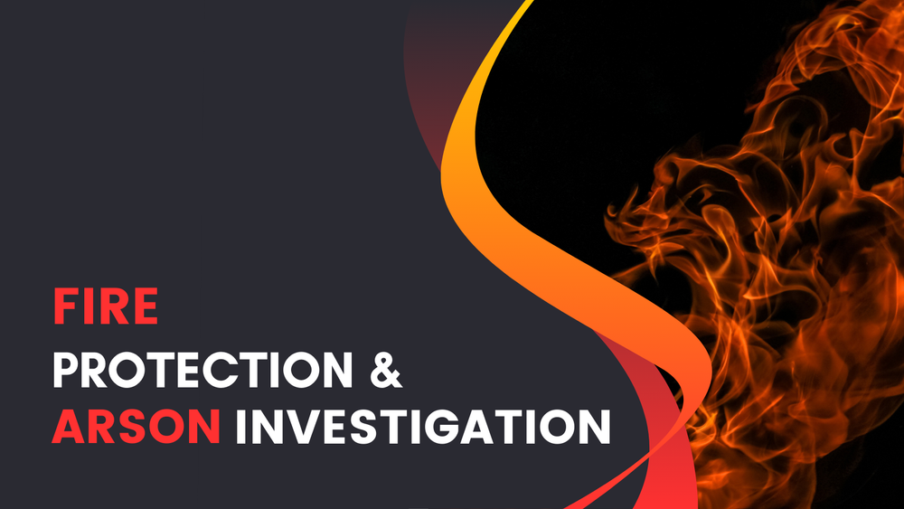
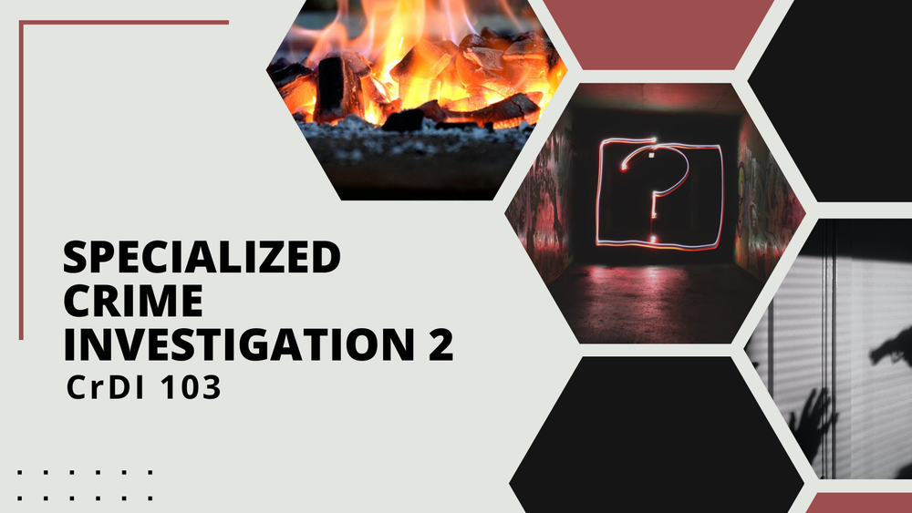
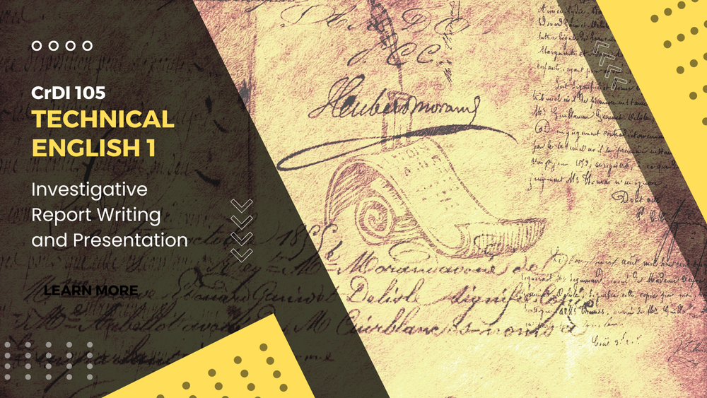
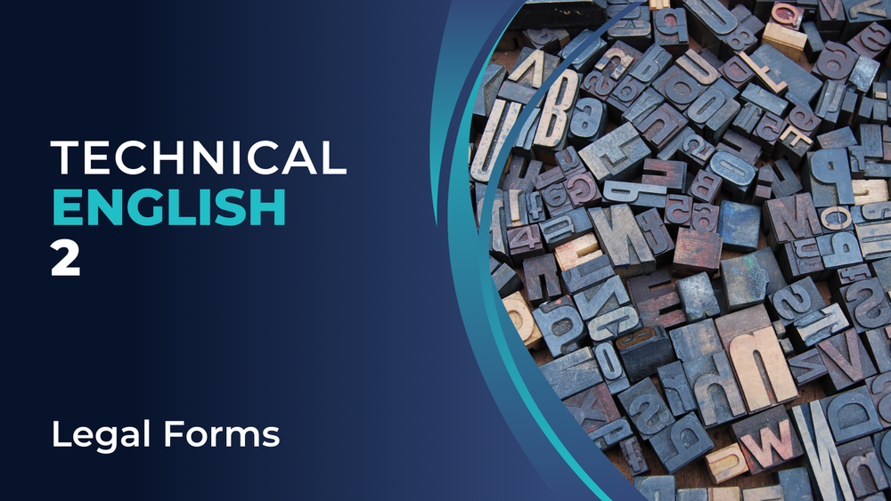
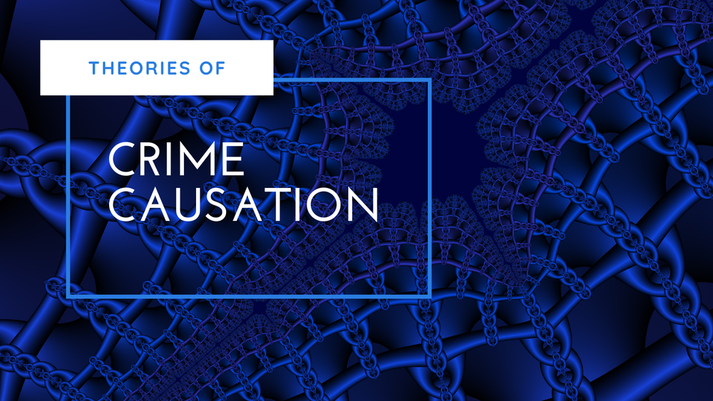
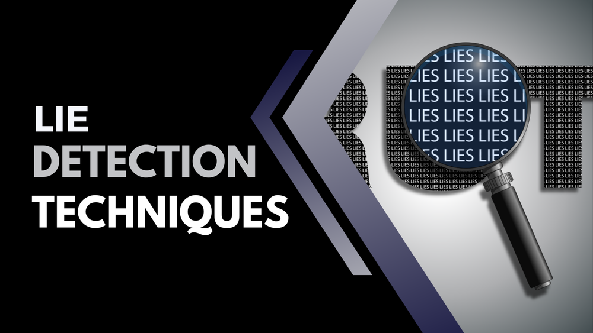

---js
const eleventyNavigation = {
	key: "Crim Notes",
	order: 4
};
---
# Crim Notes

Comprehensive lecture and review notes designed for criminology students and professionals.

This is a collection of organized, detailed lecture notes tailored for criminology students, educators, and examinees of the Criminologist Licensure Exam (CLE). These notes are ideal for in-depth study, classroom use, and self-guided review. Whether you’re a student or a professional, use these as your go-to resource to sharpen your knowledge and get exam-ready with confidence.

## Crime Detection and Investigation

### Dispute Resolution and Crises/Incidents Management

### Fire Protection and Arson Investigation

### Specialized Crime Investigation 2

[Updated to the latest CHED and PRC TOS]

### Technical English 1: Investigative Report Writing and Presentation

### Technical English 2: Legal Forms

## Criminal Sociology

### Theories of Crime Causation

## Forensic Sciences

### Forensic Ballistics

### Lie Detection Techniques

## Law Enforcement Administration

### Character Formation 2: Leadership, Decision-Making, Management, and Administration

[Updated to the latest CHED and PRC TOS]