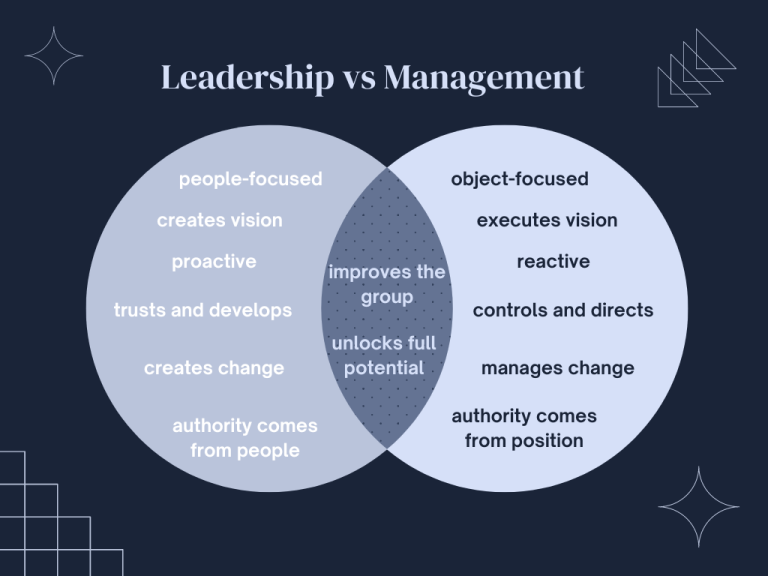

---js
const eleventyNavigation = {
	key: "Leadership and Management",
	parent: "Character Formation 2",
	title: "Character Formation 2: Chapter 1, Leadership and Management"
}
---

# Leadership and Management

## Leaders and Managers

**Leaders** and **managers** are some of the most necessary entities in any group setting. This is because groups, be they small class project groups or multinational corporations, cannot function well without the presence of these people.

While ***leadership*** and ***management*** are sometimes used interchangeably, the defining characteristics and core functions of both differentiate them markedly.

**Leadership** is the ability to motivate and influence one’s followers or members to develop themselves and work towards a common goal. **Management**, on the other hand, is the ability to control and direct the everyday working processes of an organization towards its objectives.

### Evolution of the Concept of Leadership

History, as you already know, is filled with stories of men and women who went to battle for honor and glory. Today, these types of leaders will be most suited for one specific field and not entire nations as they used to. As you can imagine, as society’s needs and structures changed, so did the concept of leadership.

It is important to learn these ideas of leadership to help with a complete understanding of the concept of leadership. The following are definitions from the past century.

**1900’s** During this time, definitions of leadership focused on control and domination. Basically, leadership was considered as the ability to impose one’s will on others. The members or the followers are not considered in any way.

**1930’s** At this time, the idea of leadership started looking into personal traits. Instead of imposing, leaders influence their followers. These traits and capabilities are acknowledged to not only come from the identified leader, but also potential leaders in the entire group.

**1940’s** During this period, the focus shifted to the group itself. Leadership is said to be whatever the behavior of an individual is while they are in control of a group.

**1950’s** At this period, the definitions of leadership focused on the following: what leaders can do in a group, shared goals based on a leader’s behavior, and efficiency.

**1960’s** Once more, the focus of the concept of leadership during this time was on the idea of shared goals. Basically, leadership was seen as any behavior that motivates people to act towards the attainment of a common objective.

**1970’s** Organizational behavior is the new focus of the definition of leadership during this time. Responsibility was considered as the core idea of leadership, but both leaders and followers were expected to be mutually motivated to act towards the attainment of organizational objectives. This responsibility includes stewardship of the organization’s resources and aiming to gain better outcomes.

**1980’s** Somehow, during this period, ideas about leadership reverted back to some of the ideas from the beginning of the century. The following themes were dominant during that time:

* members or followers are expected to act as the leader wishes
* leaders possessed traits that made them leaders, but becoming one is also based on excellence
* leaders and members transform each other by raising one another up

**1990’s to 21st Century** Different approaches to leadership were developed during this period. They will be discussed in the lesson on leadership styles.

## Leadership vs Management

As mentioned, the terms “leadership” and “management” are sometimes used interchangeably. However, they are markedly different when they come to their principles and functions.

**Leadership** is based on one’s **ability to influence** others while **management** is based on the **ability to control**. Additionally, leadership is said to be *essential* to an organization while management is *required*. Nevertheless, leadership is necessary for successfully managing an organization. Hence, all organizations must both have strong leadership and strong leadership to properly function.

The following are the key differences between the two, along with their core similarities:

Figure 1. Leadership vs Management

### Main Differences

**People-focused vs Object-focused** Leaders go direct to their people. This is why they can influence their members and followers. Managers, on the other hand, concentrate on what they consider the important things within the organization such as numbers and public image.

**Creates vision vs Executes vision** Leaders design the future of their organizations. They are like architects who develop what their organization will be. Managers are the ones who construct this design.

**Proactive vs Reactive** Before a problem comes, leaders can already see them and can already make a plan for when the time comes that the plan becomes necessary. Managers act only when issues arise. This is the same with opportunities. Leaders see opportunities and act on them immediately. Managers grab opportunities as they come.

**Trusts and develops vs Controls and directs** Literally, leaders trusts their members to do right by the organization while developing their skills and abilities. Managers make their members do according to their plans.

**Creates change vs Manages change** Leaders are transformational heads of organizations. That means they seek out chances to evolve and advance their organizations. Managers, on the other hand, are in change of dealing with these changes.

**Authority comes from the people vs Authority comes from position** Since leadership is based on the ability to influence, their people follow them because they want to. On the other hand, people follow managers because they have to. Not following your manager can result in negative repercussions to your livelihood, so you follow accordingly.

### Core Similarities

**Improves the group** Both leaders and management work in such a way that their members work towards the common goal. As a result, the group progresses accordingly.

**Unlocks full potential** Towards the attainment of the organization’s goals, members inevitably grow and advance. This is because it is the job of the heads of the organization to ensure that the members improve and gain new skills so that they can contribute well to the organization.

## Principles of Leadership

Principles are the ethics or fundamentals of an object. In the realm of leadership, these fundamentals are meant to help everyone become more effective and successful in the role.

The following are the most common tenets:

**Be a role model** Good leaders show their people exemplary behavior that is expected of everyone. As it is said, they walk the walk, not just talk the talk. Commendable behavior from each member of the organization results in better outcomes for the entire organization.

**Know your people** In relation to one of the differentiating factors of leadership, that of being people-focused, leaders must create positive and genuine relationships with their subordinates. This helps the leader better to communicate their vision, then, in turn, earn better execution from the members.

**Listen well** In relation to knowing your people, listening well does not only include a simple understanding of your people, but empathizing with them as well. That means, more than intellectually and logically knowing them, you must also be able to put yourself in their shoes. This makes your people feel valued and appreciated.

**Create change** As with the previous principle, this has already been mentioned. Leaders are transformational people. They do this to move forward their organizations. Nevertheless, it should be noted that this does not only involve changes made for financial gain, but also changes that could better the organization in general.

**Accept your flaws and be accountable** Every leader, regardless of their position in the organization, is still human. That means that they inevitably have flaws and will occasionally make mistakes. As a leader, they must acknowledge these flaws and take responsibility for their actions, especially when mistakes are made. This makes leaders more relatable and gains them even more followers.

Good leaders will then take these flaws and mistakes and learn from them. This enables the entire company to have a better view of which parts they need to look into and improve upon.

**Seek self-improvement** As they say, there is always room for improvement. A leader must put on the mindset of never stop learning. There are always ways through which one can improve. As a leader, you do this by improving both your skills and knowledge in your field as well as your leadership skills.

**Promote diversity** That is, encourage the teamwork of various types of people. Diverse peoples have diverse ideas. You never know where the next big thing can come from.

In addition to having access to different types of ideas, a diverse workforce will have varied perceptions and understanding of the world. This can then help lead the organization into new avenues for growth that a homogenous group might have never reached.

**Strive together as a team** Not only does it mean cooperating and collaborating with members to achieve organizational goals, but it also includes training together so that all members can grow with the rest of the team.

**Hold authentic values** ***Values*** are personal beliefs that guide our actions and attitudes. They can vary from person to person, as well as between different cultures. These are formed during a person’s growth and development through their personal environment. Consequently, these values guide people in making goals and through decisions. They also dictate one’s ethics.

They could include honesty, integrity, and truth, among others.

As a leader, these values will determine who will relate to you and who will follow you. People will similar values will be drawn to you, and these people become the ones whom you can inspire and motivate.

**Take advantage of technology and innovation** Leaders should be aware of advances in technology and should be knowledgeable in using them once they arrive. These technologies are designed to help people, so leaders should use them to their full potential.

For instance, communication, an important leadership skill, is now much easier using various Internet-connected gadgets. People do not have to be in the same room to have a meeting anymore. They do not even have to be in the same building to work on the same team anymore!

A leader who does not care to learn new technologies would be left behind and could potentially encounter problems leading their teams in the future.

**Develop future leaders** Organizations benefit when the leader has a plan in place for when it is time to move forward. Having someone to take over immediately during that time ensures that the team will not have to go through a period when they didn’t have someone to guide them. Otherwise, the team could be left scattered and confused.

Having future leaders in the team does not make the current leader replaceable. It makes them stronger leaders because they have a team consisting of members who are ready to take responsibility of their work and themselves.

## Theories of Leadership

Over the years, various ideas about leadership have been formulated by different theories. The following are some of them.

### Theories About Leaders
These theories propose ideas on how leaders become leaders.

#### Great Man Theory

This theory was proposed in the 19th century by Thomas Carlyle. He proposed that leaders are born as great men, and the traits that made them leaders are innate and cannot be learned by ordinary people. A core idea of the theory is that leaders are rare individuals in society who possess natural abilities and talents that enable them to shape human history.

A major criticism of the theory is the specific use of the term “great man.” This was used because, during that time, leadership was thought primarily in terms of military command and that it was a masculine task.

#### Trait Theory

The theory suggests that leaders are people who are born with specific qualities or characteristics that make them leaders.

While this sounds similar to the previous theory, it is actually an extension of the work of Carlyle by **Francis Galton**. If the name sounds familiar, that is because he is a common figure in criminology due to his involvement in the fields of psychology, specifically differential psychology, and personal identification, specifically fingerprints.

In the Great Man Theory, the focus is on the entire person. In this trait theory, the focus is on the traits that leaders posses.

#### Behavioral Theory
This theory stands in opposition to the previous two. While the previous state that leaders are born and not made, the behavioral theory states that people can be made into leaders by having them observe and imitate the behaviors and attitudes of actual leaders.

The imitation is not necessarily direct. This can be done through trainings and workshops where people can learn leadership best practices which they can then apply at their own organizations.

### Theories on Leadership

These theories suggest ideas on how leaders execute on leadership.

#### Situational Leadership Theory

There are various styles of leadership that various leaders can utilize. According to this theory, there is no one single perfect model of leadership. Instead, leaders should govern their teams according to what works best for the situation at hand.

#### Contingency Leadership Theory

This theory sits in opposition with the previous theory. It suggests that leaders cannot change their leadership style nor adjust to situations accordingly. As such, a leader’s effectiveness is contingent upon how their style matches the situation. For each type of situation, an entirely different person is required to handle that situation.

## Leadership Styles

***Leadership styles*** are the different approaches or techniques that leaders use to guide their organizations or teams. The following are some of them:

### Authoritarian Leadership (Autocratic Leadership)

> *Leaders command, followers obey.*

This connects to the earlier ideas of leadership wherein leaders are dominant people who impose their will upon the members of their organization. These types of leaders makes decisions with hardly any or absolutely no input from their members.

While this might sound rather harsh, it is an effective form of leadership when quick decisions are required or when the leader’s knowledge is indisputably the best in the group. Of course, as you might imagine, this type of leadership can also be disadvantageous as the actions of the leader might be disagreeable to the group. That could result in hostilities not only between the leader and their members, but among the members themselves as well.

### Authoritative Leadership

In this type of autocratic leadership, leaders dictate what they want and punish those who do not obey.

### Persuasive Leadership

This style of leadership is not explicitly autocratic. Leaders, instead of directly imposing their will, cause their members to believe that their singular decisions and actions will work best for the team.

### Paternalistic Leadership

As the name implies, in this form of leadership, leaders take on the role of the patriarchs or matriarchs who operates their teams as a large extended family.

### Bureaucratic Leadership

Also called organizational leadership, this type of leadership is extremely formalized and decidedly inflexible. This is because this style of leadership is based on a system of rules, procedures, and hierarches along with a definite chain of command.

### Democratic Leadership

This style of leadership is said to be the most effective as it is a type of leadership that engages the members, thereby empowering and motivating them. It sits between imposing the leader’s will upon the team and letting the team act according to their will.

### Consultative Leadership

In this style, leaders ask for the opinions and thoughts of their team.

### Participative Leadership

In this style, leaders and members are all active members of the decision-making process.

### Collaborative Leadership

Under this style, leaders create an open forum where ideas can be discussed before making a decision based on the rule of the majority.

### Transformational Leadership

This leadership style is focused on revolutionizing organizations by inspiring its members to keep pushing their limits and reaching goalposts which they never thought attainable.

### Coaching Leadership

Coach leaders think of their members as part of a team, as in a sports team. They are able to recognize their team member’s strengths and weaknesses, and develop all members so that they can better contribute to the team.

Instead of directing the members, coach leaders assist their members in goal-setting and provide regular feedback through challenging projects. They create positive and motivating environments while setting clear expectations for growth.

While this type of leadership is extremely beneficial to both the members of the organization and the organization itself, not many leaders utilize this style because it is incredibly time-consuming as it requires almost complete personal attention to every member of the organization.

### Servant Leadership

As the name implies, this style of leadership is focused upon the idea of serving one’s followers or members. That means the top priority of servant leaders are the welfare and growth of the team members. These types of leaders can work well in any type of organization but are frequently found in nonprofits where they build morale and engagement upon members.

### Transactional Leadership

These types of leaders govern their teams according to a set of rewards and punishments. That is, members are given prizes and benefits on good performance, but they can also be given sanctions for poor performance. It is also called ***managerial leadership***.

While this type of leadership can work well for organizations with specific key performance indicators (KPI’s), such as financial numbers and social media engagement, it works poorly when creativity and innovation is required.

### Pacesetting Leadership

This style is most effective when speedy results are required. That is because pacesetters like their teams moving fast and high-performing. It is almost a *laissez-faire* style of leadership as, while it is hands-on in setting the pace of work, it is hands-off when it comes to the work itself. That is, pacesetters will provide their teams with deadlines, goals, and checkpoints, but will not supply the means through which these KPI’s could be met.

### Laissez-Faire Leadership

As mentioned briefly in the previous style, laissez-faire is a hands-off leadership style. That is, leaders who use these types of leadership do not direct their members explicitly, but allow them to hold the reins when it comes to execution.

It is essentially the least productive of all styles. This is because this type of leadership breeds groups that lack a solid direction and members who lack accountability. As a result, less progress is made and fewer work gets done.

Nevertheless, it does work well for groups where each member is highly competent and does not require supervision to do work.

### Delegative Leadership

In this style of leadership, the main job of the leader is to assign tasks. While they are still responsible for the outcomes of the team, their job essentially ends at the designation of duties.

### Visionary Leadership

These leaders look almost exclusively at the big picture. They inspire their members to aspire towards lofty goals, but they do not look at the smaller details of the organization. They provide goals, but not direction.

**Note**: Do not be confused if any of the above appeared in your research as **Management Styles**. Leadership and management share similar characteristics, so these styles apply to both.

## Efficient Management

**Efficiency** is the *ability to produce results with little to no waste*, especially in terms of time, money, and effort. Management, as already defined, is the control and direction of the organizational routines.

Hence, **efficient management** could be described as the *ability to reach the organization’s objectives while using the available resources with as little waste as possible*.

### Becoming an Efficient Manager

These are some guidelines that a manager must follow if they want to be efficient.

**Understand Your Role** Be seriously involved with your organization. Participate as much as you can so that you can learn how to best help your organization reach its goals and objectives.

**Study Your Organization** Learn your organization from the inside out. This will help you fully understand its mission and purpose, which will then help you better understand your place in it.

**Serve Your Customers** Literally, provide your customers and clientele with the service that your were tasked present.

**Set Meaningful and Attainable Goals** That is, ensure that the goals you set for your team are actually within reach, but just beyond the limits. This helps ensure that your team is working on tasks that they can do, but also enables them to grows their skills.

For this, you can apply the SMART goal-setting guide.

**Implement Modern Management Techniques** Today, new methods of organizational management have been developed for the modern setting. As an efficient manager, you need to make sure that you are abreast of these developments and are able to apply them in your daily work.

## Qualities of Leaders and Managers

Great leaders are not defined by the positions that they hold in their respective organization, but by the characteristics that they possess as people. It is the same thing with managers. Without these attributes, it could be said that these people will not be in those positions that they hold.

### Qualities of a Good Leader

**Ability to Listen** Listening leads to better communication. This does not only mean being there to listen when someone is talking, but also ensuring that everyone knows that you are open to listen and that you are a safe space to which they can speak.

Better communication leads to better teamwork and better solutions to problems that the team might encounter. You will not always have the answers, but having open communication channels with your team means more minds working on the same issues.

**Clear Communication** In addition to listening, you must ensure that the communications between you and your team members are distinct and explicit. That is, while communication lines must be kept open, you must also ensure that these lines are not blurry.

**Modeling Positive Behavior** In simpler words, set a good example for your team to follow. Or, be a role model. If you are a person in position who can act as well as they talk, then the people around you will also be motivated to follow you.

**Resilience and Selflessness** A great leader must be able to withstand obstacles and stumbling blocks. Problems that arise at your organization should not be something that will make the organization fall. Instead, a leader must be able to drive the organization beyond these issues and rise better from it.

At the same time, leaders must never set themselves above their teams. If something goes wrong, the leader must take full responsibility for it. If something goes right, the leader must give credit to the team members who deserve them.

**Effective Decision-Making** Generally speaking, leaders are people who envision new things and create new solutions that have never been tested nor done before. However, such actions come with risk. As such, leaders are people who know which risks they should take and make sound decisions in order to better the organization.

#### More Notable Qualities

The following characteristics are further qualities that other sources consider essential for leaders.

* **Self-Awareness** Leaders know themselves well, both professionally and personally.
* **Adaptability and Flexibility** Good leaders are able to think outside the box and adapt to whatever situation they find themselves in.
* **Assertiveness** A good leader is able to direct people without being aggressive.
* **Gratitude** Leaders know to be thankful. People are more responsive and more willing to work for leaders who appreciate their work.
* **Capacity to Motivate People** Good leaders are able to inspire and encourage their team members to work hard and do their best.
* **Courage and Resolution** Good leaders are brave and committed enough towards leading their team to the attainment of their organization’s goals.
* **Creativity and Innovation** As already mentioned, leaders must know how to think outside the box. This does not only refer to handling critical situations, but also for new products, services, or anything else in between that could help grow the organization. Additionally, leaders should be able to not only develop their own creativity, but also that of their team.
* **Decisiveness** Great leaders are capable of making decisions and of having confidence in their choices.
* **Accountability** Leaders should learn to accept responsibility for mistakes that happen within their organization, whether it was their direct fault, and to never pass on the blame to anyone else.
* **Emotional Stability** Strong leaders are able to control their emotions and do not overreact. This includes not bringing issues at home to their professional settings.
* **Knowledge and Skill** Good leaders are, of course, knowledgeable about and skillful in their own fields.
* **Intelligence and Action-Oriented Judgement** Naturally, leaders are smart and act towards the development of their teams.
* **Competitiveness** Good leaders are driven by achievements, but not only for themselves, also their team and their team members.
* **Charisma** Great leaders are able to foster good relationships with all sorts of people. Additionally, they are able to influence other people to following them.
* **Perseverance** Leaders stick to their work, despite difficulties that they may face.
* **Confidence** Leaders believe in themselves and they are able to exude their self-assurance without coming off as arrogant.
* **Honesty and Integrity** People follow their leaders because these followers believe that they can trust and depend on their leaders.
* **Empathy** Leaders are able to connect with their team members not only professionally, but also at a personal level. They show that they genuinely care about their members both in helping them succeed at work and also in themselves as people.
* **Delegation and Empowerment** As members trust their leaders, leaders should also trust their members. Leaders can show this by giving tasks to their team members and, at the same time, allowing them to grow in their roles and capabilities.
* **Humility** As has already been mentioned, leaders should not be aggressive, nor arrogant. In other words, leaders should not be overly proud nor haughty.
* **Respect** Leaders show deference not only to their superiors, but equally to their subordinates. This helps ease tension and conflict, and improves the overall effectiveness of the organization.
* **Transparency** In line with being honest, leaders should be frank and not deceitful. If there are issues in the organization that might affect the team members, a leader should readily communicate this with the team instead of being secretive about it.
* **Vision and Purpose** Leaders should have clear goals and clear reasons for why they do the things they do.

### Qualities of Good Managers

**Expect Excellence** Good managers set high, yet attainable performance standards from their team members.

**Communicate Regularly** A good manager will always keep in touch with their team members. That is, keeping in touch with matters at work and providing feedback where necessary. Most do this via written communication, but it can also be done personally and verbally. That way, the feedback cycle runs faster.

**Adaptability and Flexibility** You would have read this in the previous group already, but good managers should also be open to new ways of looking at things and be able to adapt when necessary.

**Continuous Learning** Good managers acknowledge that, despite their position, they can still make mistakes and still have a lot to learn.

**Be a Role Model** Just as leaders set a good example for their team members to follow, good managers do so as well.

**Decisiveness** Good managers are able to make sound and timely decisions and are able to stick with them.

**Patience** A good manager knows that the development of outstanding skills and capabilities take time to develop. They must allow themselves, as well as their team members, this time and not be hasty.
