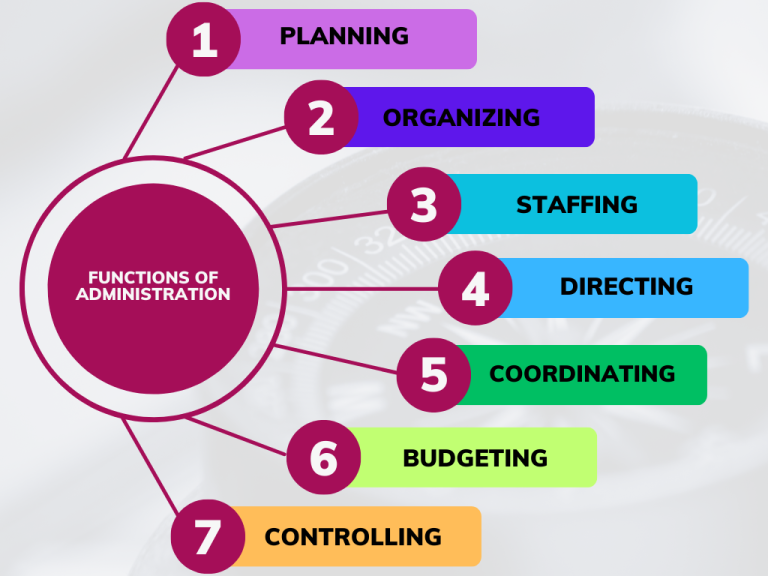
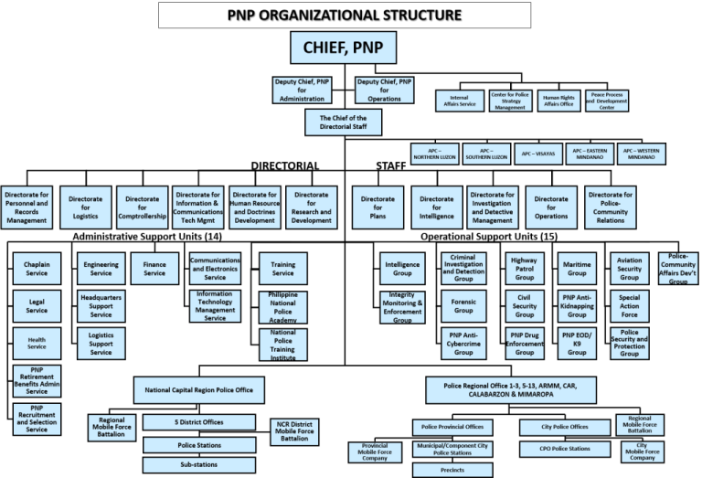

---js
const eleventyNavigation = {
	key: "Administration",
	parent: "Character Formation 2",
	title: "Character Formation 2: Chapter 2, Administration"
}
---

# Administration

## Introduction to Administration and Police Administration

### Administration

***Administer*** comes from the Latin word *administrāre*, which means *to assist, operate, perform, manage the affairs of*. This is basically what administration is all about.

Defined formally, **administration** is the *universal process of efficiently organizing and managing an organization’s resources so as to achieve its goals and objectives*. Resources include everything from the organization’s financial means to its labor pool.

This process includes the supervision and management of the functions of the different functions or systems within an organization. Additionally, administrators also govern the duties, responsibilities, and roles within the organization.

In the context of an entire country’s government, administration would generally refer to the management of public resources, such as taxpayer’s money, and services, such as public education and national security.

### Police Administration
In the simplest terms, **police administration** is the *application of all the fundamentals of administration towards law enforcement agencies*. This means that police administration is not limited to offices specifically named police. In the Philippines, this covers agencies such as the Bureau of Fire Protection and the Philippine Drug Enforcement Agency.

Police administration is concerned with the setup of the objectives, plans, and operations of a police organization. The functions of police administration include the control and operation of the duties of police agencies such as keeping the peace, improving public safety, and preventing crimes. Other activities include deployment of officers, training and development, and community relations.

Ultimately, the goal is to ensure the safety and security of the communities they serve as well as upholding the law.

Police organizations tend to be firmly hierarchical and strictly formalized. This means that the members of the police forces clearly know who their supervisors are as well as their subordinates, and each member rigorously adheres to this structure.

## Principles of Administration

Henri Fayol

By Unknown author – early 20th century photograph (first version found online at centre-histoire.sciences-po.fr, Public Domain, [https://commons.wikimedia.org/w/index.php?curid=1503102](https://commons.wikimedia.org/w/index.php?curid=1503102)

**Henri Fayol** was a 20th century economist who developed what is now called Fayolism. Under this theory, Fayol lays out the 14 principles of administration:

* **Division of Labor** This is the idea of splitting a task into smaller subtasks. This speeds up the work process and allows members of the team to specialize, thereby making them more productive in the future.
* **Authority and Responsibility** Authorities are the powers that supervisors have in an organization. Responsibilities are the limits to their powers.
* **Discipline** Employees must obey their leaders as well as the organization’s policies.
* **Unity of Command** One mission, one boss. Every employee must have only one direct report so that no communication lines are crossed.
* **Unity of Direction** Everyone in the organization must work towards the same goals and objectives.
* **Subordination of Individual Interests to the General Interest** Administrative personnel must ensure that the interests of the company are always ahead of the interests of the individual members.
* **Remuneration** All workers must be paid fairly and proportionately.
* **Centralization** Decision-making in the company must be sent towards higher authorities only.
* **Scalar Chain** All members of the organization should be part of the hierarchy. The lines from the top management to the entry-level workers must be clearly drawn and followed. However, the structure cannot be too broad nor have too many levels.
* **Order** Social order among employees must be established. The same thing applies to the material resources of the organization. This avoids waste and erroneous handling.
* **Equity** Employees must be treated fairly and kindly.
* **Tenure** This refers to job security. Employees work better in an environment where they can feel assured of continuous employment as well as career growth.
* **Initiative** Allowing employees to use their creativity and inventiveness at work makes the company stronger.
* ***Esprit de Corps*** Administrators must create a positive environment so that personnel constantly have high morale and the team spirit is always cheerful. It helps to try and build the unity of the team as well as harmony between team members.

## Theories of Administration

Generally, there are two different approaches to administration: traditional and contemporary.

In the **traditional approach**, we have the following theories:

* **Classical Approach or Bureaucratic Theory** This theory is a mechanical approach to administration that ignores human nature. According to this theory, the most important components of organizations are strict hierarchies, chains of command and control, formal rules, and well-defined procedures.
* **Behavioral Management Approach or Human Relations Theory** In this school of thought, importance is placed on the welfare of the employees. According to this theory, administrators ought to pursue democratic and flexible solutions ways of directing their organizations. Companies that use this approach tend to have an informal workplace setups where leaders take on the role of motivators and influencers steering their teams towards the attainment of organizational goals.

The following are the **contemporary theories**:

* **Contingency Theory** In this theory, managers administer their organizations based on all key factors existent in the current situation. It is said that there is no single “best” way to run an organization, so they must always be handled according each situation.
* **System Theory** According to this theory, organizations work as an inter-related system of parts. Just like a computer system, if one part is not working, the entire system will break down and not work.
* **Chaos Theory** In general, the chaos theory states that all events in reality are random and cannot be controlled. Relating it to institutions, it means that they evolve like biological systems: the more complex it becomes, the more energy is required to maintain it.
* **Scientific Management Theory** This is a theory Developed by Frederick Taylor that emphasized the use of scientific methods to improve productivity in the workplace. This includes using time and motion studies, job analysis, and standardized work procedures to help improve efficiency.
* **Administrative Management Theory** This is Henri Fayol’s theory where he outlined the Principles of Administration. It focuses on the different functions of management.

### Theories of Police Administration

* **Home Rule Theory** In this theory, police officers are said to be servants of the community.
* **Continental Theory** This theory is opposite of the previous one. Under this theory, police officers operate as servants of higher authorities.
* **Problem-Oriented Policing** This theory proposes that policing should focus on identifying and addressing underlying problems that contribute to law and order problems in the area. Furthermore, it says that effective policing must be done proactively and with a problem-solving approach that is designed according to the needs of each community.
* **Community Policing** Under this theory, police agencies are encouraged to foster positive relationships with the communities they serve as well as other law enforcement agencies serving the area. Emphasis is placed upon building trust, friendship, communication, and addressing the root causes of crime and disorder.

### Community Policing

This theory is being applied in the country by our Philippine National Police (PNP) as part of an effort to change the image of police officers. The goal is to transform police officers from people to fear to people who are friends. That is, instead of using *“Hala ka, adi na it mga pulis!*” to scare children, the PNP wants the community to be able to say, “*Adi na an aton mga sangkay nga mga pulis!*“

Further to this concept, being able to build deeper connections within the community means being able to get more information and being better able to solve community problems.

#### Core Elements of Community Policing

* **Developing community partnerships** Police agencies build partnerships with the following components of communities:
	* *Other Government Agencies*: probation and parole, health and human services, schools, etc.
	* *Community Members and Groups* Building partnerships with people who live and work in the community helps develop trust and transparency, which leads to more efficient and effective policing.
	* *Non-Profits and Service Providers* This includes non-government organizations and similar institutions that serve the community.
	* *Private Businesses* This includes all forms of businesses from micro-entrepreneurs to large multinational corporations, along with chambers of commerce and visitor bureaus.
	* *Media* This includes local newspapers, television outlets, radio stations, and creators in the new media such as bloggers and vloggers. This helps police agencies improve their transparency and gain a better public image, which then leads to more effective policing.

* **Engaging in problem-solving** Policing is supposed to be a proactive process. Hence, police officers are encouraged to take initiative and identify problems, develop innovative responses, and evaluate accordingly. These are the general steps to take when problem-solving:
	* *Scanning* Determining the nature and scope of the problem
	* *Analysis* Carefully understand the problem
	* *Response* Develop solutions
	* *Assessment* Evaluate the success of the response and adjust accordingly
	* *Using the crime triangle* Look for vulnerabilities in the crime triangle and disrupt the lines among the victims, offenders, and locations

* **Implementing community policing organizational features** These features help support community policing:
	* *Agency Management* Incorporating community policy ideals into all areas of the agency
	* *Organizational Structure* This refers to creating a structure that empowers line-level officers to interact and build relationships with their community members on a daily basis.
	* *Personnel* Community policing practices should be incorporated into all areas of staffing: recruitment, hiring, selection, training, evaluations.
	* *Information and Systems Technology* Providing access to accurate community information and improving two-way communication between the community and the police officers

## Functions of Administration

### Planning

This refers to deciding in advance the future actions of the organization. It is an entire intellectual process that involves creating goals and arranging coordinated and consistent sets of activities that will work towards the attainment of organizational objectives.

### Organizing

This is the action of creating a coherent unity in the organization. It involves arranging and coordinating resources to achieve desired objectives. Furthermore, it includes delegation of authority, determining the roles and responsibilities of individuals or groups, and establishing clear lines of communication.

### Staffing

This refers to recruiting, selecting, and training the right people at the right time for the right position. Furthermore, it is the responsibility of administration to motivate and develop the people who are already in position as well as ensuring that the organization retains these people.

### Directing

This means leading people to ensure that they perform their roles effectively. It includes communicating expectations, orders, assignments, and instructions, as well as providing feedback and resolving conflict.

### Coordinating

It refers to the act of synchronizing people and activities so that they function smoothly towards the attainment of organizational objectives. Different types of organizations require different amounts of coordination.

### Budgeting

The budget is said to be the heart of administrative management. This refers to the logical arrangement of the company’s financial resources so that they are expended towards the attainment of organizational objectives.

### Controlling

It involves the monitoring and evaluation of the performance of the members of the organization to help ensure that the objectives are being achieved. It includes setting performance expectations, measuring actual performance, and taking corrective action where necessary.

## Police Management

This refers to the administrative process of coordinating, controlling, and directing all aspects of a police organization in order to:

* prevent crime
* apprehend criminals
* recover stolen property
* perform regulatory and aid services

In other words, it is the everyday act of running the police department. Furthermore, it involves the implementation of policies and procedures through which each officer operates.

The following are the key aspects of police management:

* **Leadership** Strong leadership is required at all levels of a police agency for effective police management. Leaders must be able to motivate and inspire personnel, set a clear direction for the agency, and create a culture of accountability and professionalism.
* **Planning** This involves identifying goals and objectives for the agency, as well as the development of operational plans to achieve those goals. Additionally, it includes setting priorities, allocating resource, and coordinating efforts across the agency.
* **Budget and Finance** Administrators handling this aspect develop budgets, allocate funds, and monitor expenditures. They must ensure that the agency is operating within its budget and in compliance with relevant laws and regulations.
* **Personnel Management** This includes recruiting, selecting, training, and managing personnel to ensure that the agency is qualified with competent individuals as well as developing policies for hiring, promotion, discipline, and termination.
* **Performance Management** This is the task of monitoring the performance of personnel and the agency as a whole, using data and other metrics to evaluate the effectiveness of policies and procedures. They must also provide feedback and support to personnel to help them improve their performance.
* **Community Relations** In line with community policing principles, this involves developing and maintaining positive relationships with the communities they serve. Additionally, this involves engaging with community members, addressing concerns and complaints, and promoting transparency and accountability.
* **Emergency Management** This refers to the responsibility of preparing the agency to respond to emergencies and disasters, including developing plans for evacuations, sheltering, and response to natural disasters, terrorism, and other emergencies.

Effective police management requires a commitment to continuous improvement, a focus on data-driven decision-making, and a willingness to adapt to changing circumstances and priorities.

### Main Components of the Managerial Process in Police Organizations

* **Management** Directing individuals to achieve organizational goals in an efficient and effective manner
* **Planning** Preparing for the future by setting goals and objectives and developing courses of action for accomplishing them
* **Organizing** Arranging personnel and physical resources to carry out plans and accomplish goals and objectives
* **Leading** Motivating others to perform various tasks that will contribute to the accomplishment of goals and objectives
* **Controlling** Determining how the quality and quantity of departmental systems and services can be improved if goals and objectives are being accomplished; it is also concerned with efficiency and effectiveness
* **Chain of Command** Indicates that the higher the position one holds, the greater the powers, authority, and influence one possesses

#### Levels in the Chain of Command
* **Top Managers** Conducts the overall goal formulation and making policy decisions regarding the allocation of resources
* **Middle Managers** Formulates objectives and plans for implementing decisions from above and coordinating activities below
* **Lower Managers** Implements decisions made at higher levels and coordinates and directs the work of employees at the lowest level of the organization
* **Rank and File** Carries out assigned tasks

### Major Developmental Perspectives in Police Management
* **Classical Police Management** bureaucratic; an organization must operate rationally
* **Behavioral Police Management** more flexible and democratic organization model
* **Contemporary Police Management** responds to the nature of policing and it drive to keep pace with societal changes

## Division of Work

This refers to the breaking down of tasks into smaller ones. Also known as division of labor, this is said to improve efficiency while allowing team members to specialize. Specialization then further increases efficiency.

In the real world, division of work is achieved by creating different work sectors:

* **Primary Sector** Works on the extraction of natural resources, e.g. mining, agriculture, forestry, fishing
* **Secondary Sector** Works on the processing of raw materials, e.g. manufacturing, construction, energy production
* **Tertiary Sector** Provides services to people and businesses, e.g. retail, education, healthcare, transportation, finance

### Police Division of Work

In the police organization, work is divided among various units and personnel:

* **Patrol** Responsible for the prevention of crime and the maintenance of public order within a specified geographic area. They respond to calls for services, conduct initial investigations, and engage in proactive policing activities to deter criminal activity.
* **Investigation Responsible** for conducting in-depth investigations into specific crimes or criminal activities. They often work closely with other law enforcement agencies and tend to further specialize in areas such as narcotics, organized crime, or fraud.
* **Administration Responsible** for the management of the law enforcement agency.
* **Special Operations Responsible** for responding to specific types of situations that require specialized training and equipment. These includes SWAT teams, hostage negotiators, or bomb squads.
* **Support Services Responsible** for providing logistical and administrative support to other units within the agency. This includes functions such as records management, evidence processing, and forensic analysis.
* **Community Relations Responsible** for developing and maintaining positive relationships with the community. They may engage in outreach activities to promote trust and communication between the police and the community.
* **Traffic Responsible** for enforcing traffic laws, investigating traffic accidents, managing traffic flow within a specified jurisdiction. They may also engage in public education campaigns to promote safe driving habits.

Division of work is implemented in law enforcement agencies to ensure that each unit has clearly defined roles and responsibilities, and that each officer is sufficiently trained and equipped to carry out their assigned tasks effectively.

## Authority and Responsibility

Another one of the principles of administration, *authority and responsibility* go together for everyone involved in administration.

**Authority** refers to *the powers that a person holds in their organization*. This includes the right to command and require obedience. **Responsibility** refers to *the limits on a person’s powers in an organization*. This includes the obligation to follow through on tasks assigned to them and those they have delegated to others.

One cannot have authority without responsibility.

### Authority

#### Sources of Authority
* **Legitimate Power** Arises from the status quo and a cultural system of obligations of rights and duties and based on the acceptance of the people
* **Coercive Power** Derived from a person’s ability to instill fear among people and the expectation that punishment will be handed down to those who do not obey
* **Reward Power** Opposite to coercive power, reward power is based on the ability of some people to hand out rewards and prizes
* **Expert Power** Based on a person’s knowledge, skills, and expertise in certain fields. Since superiors possess these capabilities, subordinates desire and fulfill their direction.
* **Referent Power** Derived from the recognition of a person’s faith as a leader who is held in high esteem, admiration, and often imitation by the subordinate

#### Characteristics

* **It is the basis of getting things done.** People who have authority has the right to influence the behavior of others in an organization with the performance of certain activities to meet defined objectives.
* **Legitimacy** Authority is accepted because it holds some validity.
* **Decision-Making** People in authority have the right to decide on organizational matters
* **Subjectivity in Implementation** Authority is significantly influenced by subjective factors such as the personality of the manager and the environment in which the authority is being exercised.

In general, people in authority are granted the following:
- decision-making powers
- control over resources
- ability to delegate tasks
- the power to enforce rules and regulations
- the ability to hire, fire, or discipline employees
- the ability to sign legal documents
- the power to negotiate contracts
- the ability to make policy changes

### Responsibility

As previously mentioned, responsibility, in the context of authority and responsibility, is the limitation on someone’s organizational powers.

Defined by itself, responsibility refers to one’s obligation to complete assigned tasks or perform assigned duties. Responsibility, unlike authority, cannot be delegated. One is accountable for ones tasks and duties. Additionally, it flows from top to bottom in any organization and it can be qualitative or quantitative in nature.

#### Forms of Responsibility

* **Operating Responsibility** Refers to an individual’s responsibility to carry out assigned tasks
* **Ultimate Responsibility** Refers to the obligation of the manager who ensures that the work is done efficiently by the members of the team

In general, people in authority hold the following responsibilities:
- accountability for the outcomes of decisions made
- oversight of the performance of subordinates
- compliance with laws and regulations
- use of resources
- maintaining the health and safety of employees and customers
- meeting financial targets and objectives
- maintaining the reputation and public image of the organization
- protecting confidential and sensitive information

### Authority and Responsibility in the Police Organization

In police organizations, officers are vested with powers and obligations based on the existing laws of the land. They include the following:

### Authorities

- **Maintaining Law and Order** Police forces are granted to exercise this authority within their respective jurisdiction by enforcing laws, preventing crime, and ensuring public safety
- **Making Arrests** This is exercised upon individuals who violate the law
- **Use of Force** When necessary while carrying out duties, police officers may use both non-lethal and lethal force in certain situations
- **Investigation** Used on criminal activities to gather evidence and make referrals for prosecution
- **Traffic Control** Regulate traffic, investigate accidents and enforce traffic laws

### Responsibilities

- **Public Safety** Ensure the safety and security of the public by preventing and responding to criminal activity, natural disasters, and other emergencies
- **Law Enforcement** Enforce all national laws and local ordinances and ensure that violators are held accountable
- **Community Relations** Maintain positive relationships with the community, including promoting trust, transparency, and communication
- **Training and Development** Provide training and development opportunities for personnel to ensure that they are equipped with the skills and knowledge necessary to carry out their duties effectively and professionally
- **Fiscal Responsibility** Manage agency budgets and ensure the efficient use of resources
- **Accountability** Hold personnel accountable for their actions and ensure that internal policies and procedures are followed

Police administration is only effective when law enforcement agencies and their personnel clearly understand their authorities and responsibilities. This ensures accountability, transparency, and effective decision-making, while also ensuring that law enforcement agencies operate within the bounds of the law and respect the rights of the public that they have sworn to serve and protect.

## Unity of Command

*Unity of command* is another of the principles of administration. It is implemented when all the members of an organization follow the direction of one supervisor.

Most organizations will have more than one person managing numerous workers in various departments. This does not mean that there is no unity of command. It will still be followed so long as each member reports to a single supervisor who is in turn accountable for their performance and conduct.

This helps minimize confusion, reduce errors, and promote consistency and accountability in decision-making. It also helps ensure that all employees understand their roles, responsibilities, and performance expectations. By providing clear lines of communication and accountability, it can also help promote a positive work environment, enhance employee morale, and improve overall agency effectiveness.

Remember that no person can effectively serve two masters at the same time.

### Chain of Command

This refers to the arrangement of all members of the organization from top to bottom based on rank or position and authority. It establishes obedience to all personnel by way of identifying all supervisors necessary to enforce rules and regulations.

### Span of Control

It refers to the maximum number of personnel or subordinates a superior can effectively and efficiently handle. Any supervisor should not have more subordinates than they can handle, oversee, or control. Supervisors should avoid overestimating their capabilities and be willing to delegate authority to ensure effective command.

### Advantages of Unity of Command
- Better relationships among superiors and subordinates
- Clear authority, responsibility, and accountability
- Reduces and/or avoid duplication of work
- Prompt or quick decisions
- Good, effective, and efficient discipline
- Better coordination and teamwork
- Boost morale and positive attitude of team members
- Leads to higher productivity of goods and services

### Unity of Command in the Police Organization

In law enforcement agencies, unity of command is achieved by having one chief who is the ultimate authority responsible for the direction and control of the organization. In the PNP, this is the **Chief, PNP** who typically holds the rank of **police general**, PGEN.

This principle is essential in police organizations as it helps promote organizational efficiency, accountability, and unity of effort.

Organizational Structure of the Philippine National Police

Source: [https://pnp.gov.ph/wp-content/uploads/2022/03/orgstructure030322-1024×697.png](https://pnp.gov.ph/wp-content/uploads/2022/03/orgstructure030322-1024×697.png)

## Scalar Chain

Another principle of administration, ***scalar chain***, also known as the ***scalar principle***, refers to *the links in the authority and communication in an organization*. It involves a clear and defined hierarchy of positions and levels of authority, with each position reporting to the one directly above it, all the way up to the highest level of authority in the agency.

It is predicated on all members of the organization recognizing this unbroken line of authority from the highest levels of management, down to the rank and file. Each level of the chain reports to the level above it and is responsible for overseeing and directing the work of the level below it.

This helps ensure that information flows smoothly within the agency. Each level of the chain is responsible for transmitting information up and down the chain, which ensures that everyone has access to the information they need to perform their duties effectively.

According to Fayol, the chain must be followed strictly.

That said, this chain may be circumvented during times of emergency and even for operational efficiency. This can be done by allowing two people at the same level to connect with each other instead of going through the people above them first, as long as their supervisors are aware of this communication. This exception is called a **gangplank**.

If implemented, the manager at the highest level of the organization has the most decision-making power, and responsibility for decisions decreases as one goes down the chain. Highly-centralized organizations use this to ensure that decision-making power remains in the control of high-ranking officers.

### Advantages of Scalar Chain

- **Efficient decision-making** This can remove dissent from decision-making processes as all managers know what decisions are within their scope.
- **Clear lines of communication** This allows employees access to their immediate supervisor who can run information up the chain of command if necessary.
- **Well-defined relationships** Creates a linear delegation of authority in which relationships between managers and their subordinates are clearly defined.

### Disadvantages of Scalar Chain
- **Lower levels of management may feel isolated** Top-level management is only accessible through a linear chain of command.
- **Potential for miscommunication** If even one person in the hierarchy does not communicate information accurately, everyone who receives it after them will suffer.
- **No diagonal communication** Diagonal communication refers to the connection between two people of different ranks from different units of the organization. Scalar chain does not allow this type of communication due to the hierarchical setup of the lines of communication.
