---js
const eleventyNavigation = {
	key: "Forensic Ballistics: Chapter 1, Overview of Forensic Ballistics",
	parent: "Forensic Ballistics"
}
---

# Overview of Forensic Ballistics

**Ballistics** is *the applied science concerned with the motion of projectiles* – especially those projectiles that are used in ranged weaponry. In this course, we are especially concerned with the applications of this science towards the law. Specifically, as the title of the course suggests, we will be focusing on ***Forensic Ballistics*** in this course.

The word *“ballistics”* originated from the Greek word *“ballein”* or *“ballo.”* It means *“to throw“*. If you watch movies set in the Ancient Roman era, you might be familiar with this weapon of war:

(By Pearson Scott Foresman – Archives of Pearson Scott Foresman, donated to the Wikimedia Foundation, Public Domain, [https://commons.wikimedia.org/w/index.php?curid=35499962](https://commons.wikimedia.org/w/index.php?curid=35499962))

This is called a *ballista* and the name is another origin word for ballistics. This weapon usually comes in the form of a gigantic bow or catapult and is used to hurl large objects, particularly stones, at animals or enemy forces.

While the term “ballistics” generally refers to the study of the trajectory of projectiles, the science itself was developed to facilitate the examination of firearms, ammunition, and related objects.

The phrase *forensic ballistics* was first coined by **Col. Calvin Goddard**, named the *Father of Modern Ballistics*. He was a forensic scientist, army officer and academic researcher who was a pioneer in the field.

***Forensic Ballistics*** deals with the use of firearms science as applied to the law. Therefore, it is necessary for anyone interested in becoming a law enforcer to understand the science.

## Challenges Faced by Forensic Ballistics
Forensic ballistics, like most other sciences, face issues and problems in its execution. Some of them are the following:

- **Limited Evidence** In most cases involving firearms, only spent bullets, cartridge cases, or gunshot residue may be available as evidence, making it difficult to determine the exact firearm used or the shooter’s identity.
- **Lack of Standardization** Standardized testing procedures and databases can sometimes not be available, thus hindering the comparison of ballistic evidence across different jurisdictions.
- **Evolving Technology** Advances in firearms and ammunitions technology can make it challenging for forensic experts to keep up with new firearm models and their unique characteristics.
- **Human Error** Human bias and subjective judgement can influence forensic ballistics analysis, potentially leading to incorrect conclusions.
- **Limited Resources** Many forensic laboratories have limited resources, which can lead to delays in processing ballistic evidence and backlogs in cases.
- **Lack of Training and Expertise** Not all forensic laboratories have access to experienced and well-trained firearms examiners, which can impact the quality of analyses.
- **Chain of Custody Issues** Proper handling and preservation of ballistic evidence are crucial, and any break in the chain of custody can compromise its integrity.
- **Ethical Concerns** The potential for misuse of forensic ballistics analysis, such as wrongful convictions, raises ethical questions about its application.

## History of Forensic Ballistics

The history of forensic ballistics begins in the **1493 – 1508** period when **Harold Peterson**, in a book, discusses firearm riflings with **Emperor Maximillian of Germany**. This is the earliest known reference to any manner of analysis when it comes to firearms. The value of rifling was not recognized until the late 19th century.

Around **1835 – 1899**, certain techniques were developed, including *simple observation, physical matching, caliber determination* from an examination of the shape and size of a projectile, and experimentation, that would ultimately be associated with the field of forensic ballistics.

During **1900 – 1930**, the science gained recognition from several judicial systems around the world due to particular events where it become most helpful.

In **1929**, the **St. Valentine’s Day Massacre** occurred. This was an incident related to gangster violence and happened in Chicago in the USA. The investigations done in the aftermath of the event bolstered the reputation of firearm identification techniques.

During the **1930 – 1970** period, more events occurred that moved forensic ballistics forward.

In the United States, the **Scientific Crime Detection Laboratory (SCDL)** began operations at **Northwestern University** in **late 1929 or early 1930**.

In **1932**, the **Federal Bureau of Identification Laboratory** was formed. Similar laboratories were also created all over the world as the science continued to evolve during the period.

Meanwhile, the **Bureau of Forensic Ballistics** was established by **Charles E. Waite**, **Maj. (later Col.) Calvin H. Goddard**, **Phillip O. Gravelle**, and **John H. Fisler** in New York, New York in **1935**.

Then, the **Association of Firearm and Toolmark Examiners (AFTE)** was organized in Chicago, IL in **February 1969**.

During **1970 – 1999**, The evolution of forensic ballistics continued along with significant growth in the number of scientists being employed in the field. New tools coming from various technological advancements of the era, including computers and the binocular comparison microscope, markedly contributed to the evolutionary changes happening in the field.

## Relevant Personalities

### Forensic Ballistics

**Col. Calvin H. Goddard**
*Father of Modern Ballistics*
Invented comparison microscope and helixometer

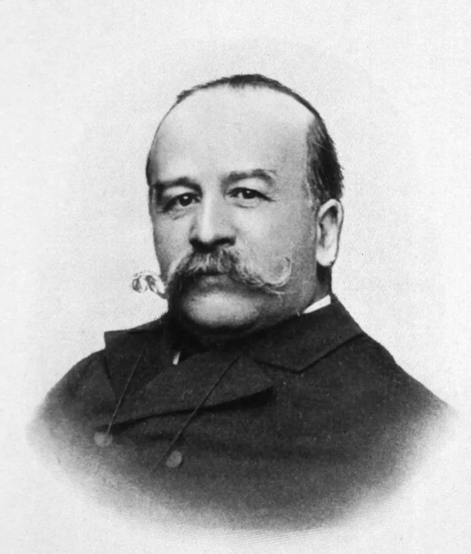

**Alexander Lacassagne**
He was the first to recognize the significance of striations etched on a bullet extracted from a murder victim and its link to the gun from which it was fired, thus beginning the science of ballistics.

**Edmond Locard**
He was a French criminologist who became known as the “Sherlock Holmes of France” and formulated the basic principle of forensic science: Every contact leaves a trace.

### Firearms

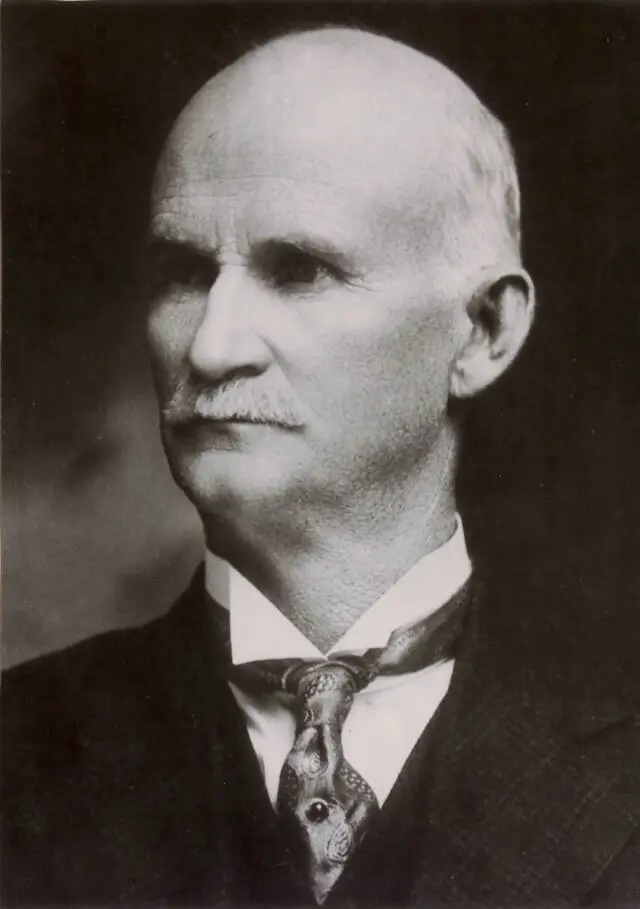

**John M. Browning**
*Wizard of Modern Firearms*
Pioneered the breech-loading single-shot rifle that was later adapted by Winchester

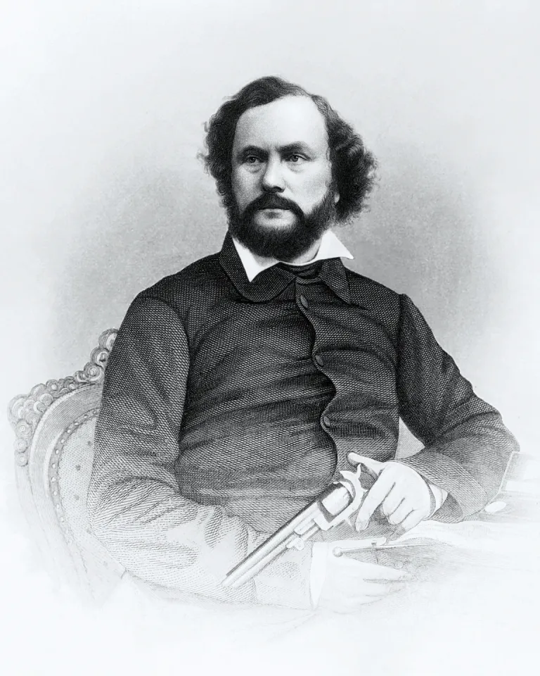

**Samuel Colt**
Produced the first practical revolver, the Colt Peace Maker, one of the most famous revolvers

**Henry Derringer**
Manufacturer of rocket pistol

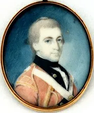

**Maj. Patrick Ferguson**
Designed the “Ferguson” rifle

**Alexander John Forsyth**
*Father of Percussion Powder*
Invented the percussion system of ignition

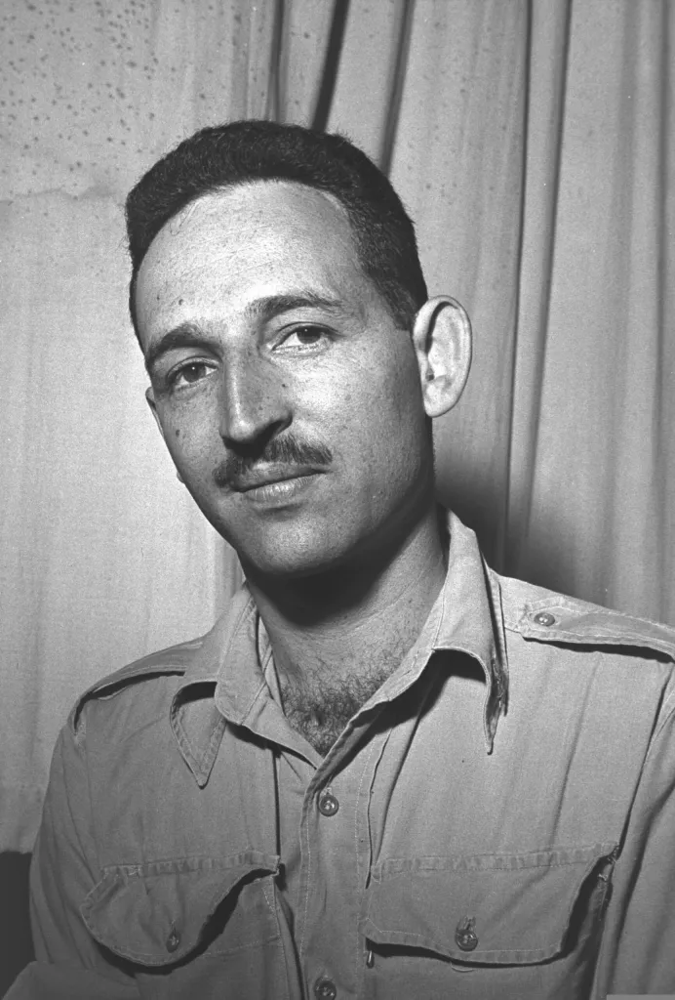

**Maj. Uziel Gal**
Israeli army officer who designed the UZI in 1950

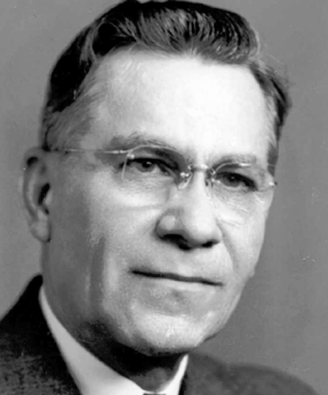

**John C. Garand**
Designed and invented the semi-automatic US Rifle Cal. 30 M1 Garand

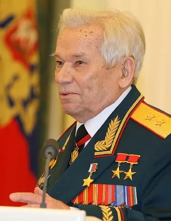

**Mikhail Kalashnikov**
Designed the AK-47 (Automat Kalashnikova) that was used by the Russian army in 1951

**John Mahlon Marlin**
*Founder of Marlin Firearms Company*
Famous for Marlin Cal. 22 Carbine

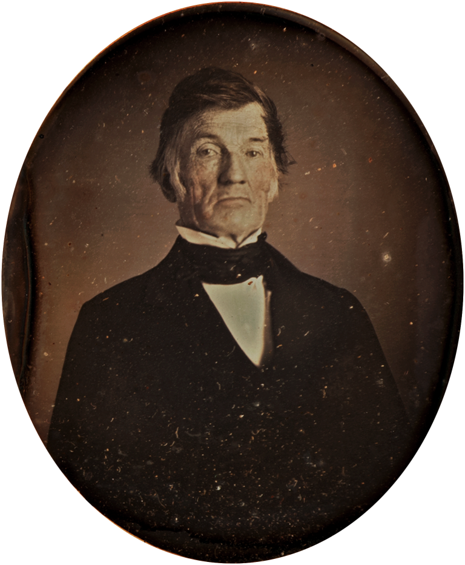

**Eliphalet Remington**
One of the first rifle makers

**Benjamin Robins**
One of the first to state sound ballistics theories

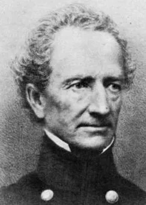

**James Wolfe Ripley**
Stimulated the development of the Model 1055 rifled musket

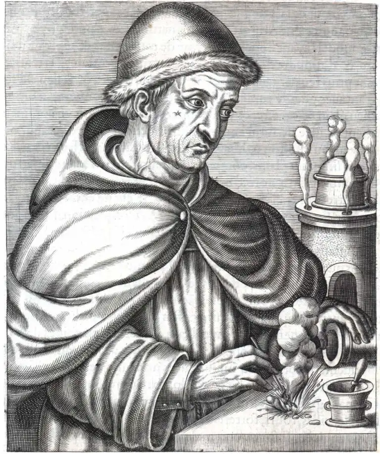

**Berthold Schwarz**

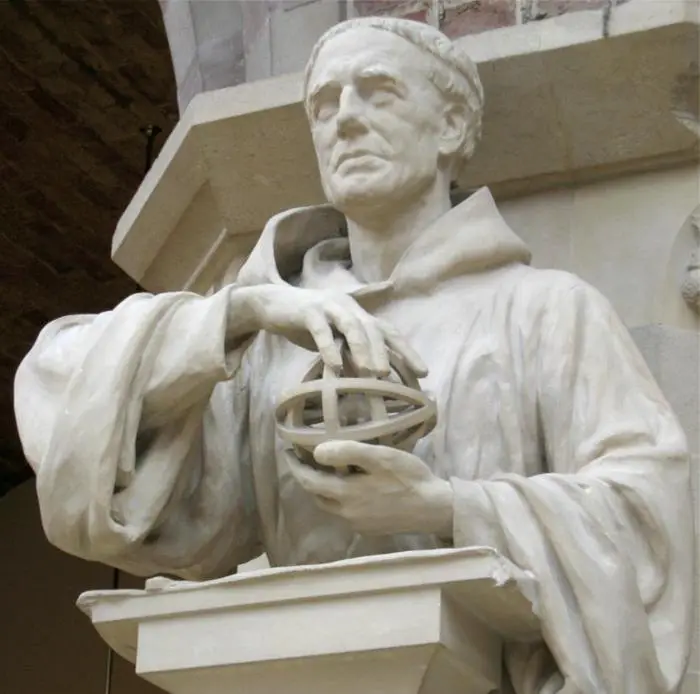

**Roger Bacon**
They are credited to have invented the first gunpowder.

**Elisha King Root**
Helped Samuel Colt synthesize the manufacture of firearms

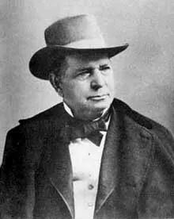

**Oliver Fisher Winchester**
One of the earliest rifle and pistol makers
Manufactured the Winchester repeating rifle

**David “Carbine” Williams**
Maker of the first known carbines

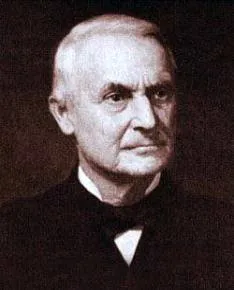

**Horace Smith**
*Founded Smith & Wesson*
Pioneered the making of breech-loading rifle

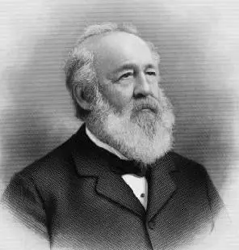

**Daniel Baird Wesson**
Partner of Horace Smith in revolver making

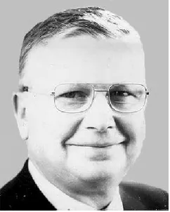

**Eugene Stoner**
Deisgned the US M16 Armalite (AR15) under license by the Colt Company from July 1953 onwards

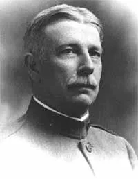

**John T. Thompson**
Maker of the Thompson submachine gun – the first hand-held machine gun

**Melvin M. Johnson, Jr.**
Invented the Johnson Model 1941 rifle – one of the most innovative rifles of its time period

**Carl Walther**
Developed small caliber pistol in 1866

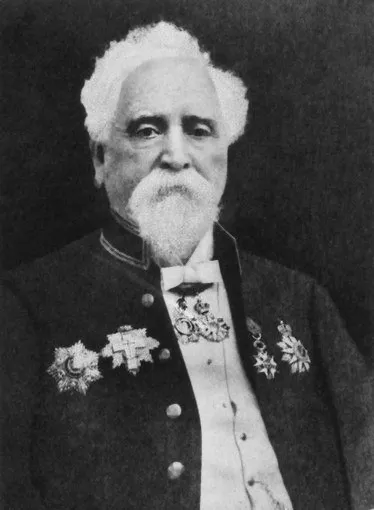

**Hiram Stevens Maxim**
Inventor of the Maxim Machine Gun and the Maxim Silencer

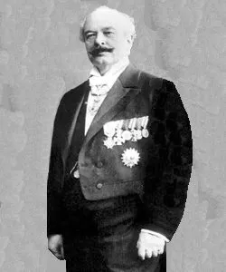

**Georg Luger**
Did lasting design work in connection with the 9mm parabellum cartridge

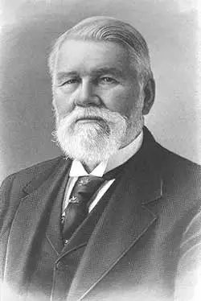

**Dr. Richard Gatling**
Patented the Gatling Gun – six-barreled, hand-cranked weapon that can fire up to 200 rounds/minute
