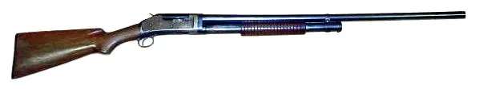
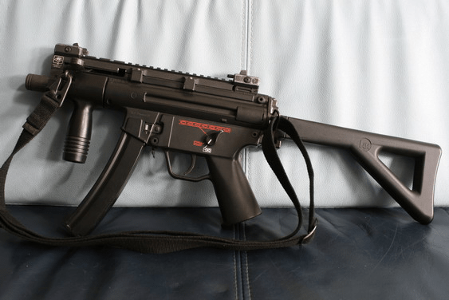
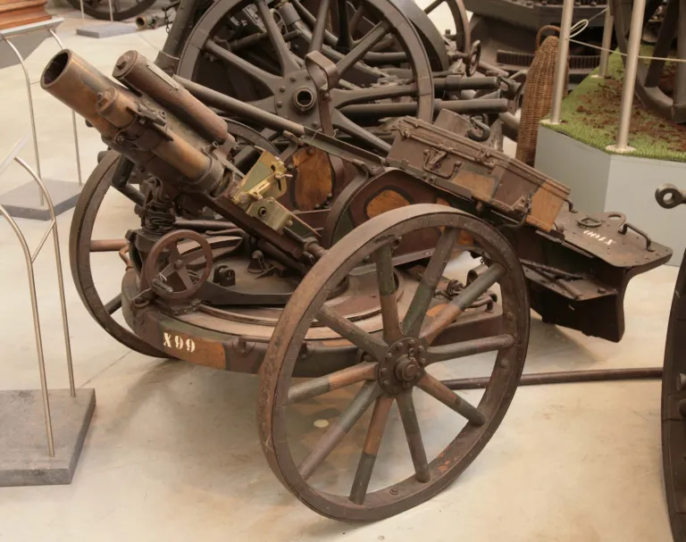
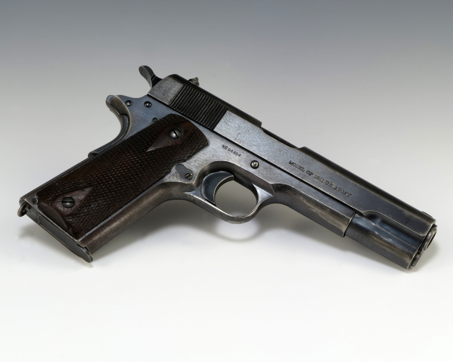

---js
const eleventyNavigation = {
	key: "Firearms",
	parent: "Forensic Ballistics",
	title: "Forensic Ballistics: Chapter 2, Firearms"
}
---

# Firearms

A **firearm** is *an instrument used for the propulsion of a projectile through the expansive force gases coming from burning gunpowder*. (FBI Manual of Firearms Identification)

Legally speaking, firearms or arms include “rifles, muskets, carbines, shotgun, pistol, revolvers, and all other deadly weapons, from which a bullet, ball, shot, shell, or other missiles may be discharged by means of gun powder or other explosives. This term also includes air rifles, except such of being of small caliber and limited range used as toys. The barrel of any firearm shall be considered a complete firearm.” (Sec 877 Revised Administrative Code/ Sec. 290 national Internal Revenue Code)

## Evolution of Firearms

**Stages of Development of Mankind’s Weaponry**

Simplified, the evolution of human weaponry followed this path: STONES > CLUBS > KNIVES > SPEARS AND DARTS > SLINGSHOTS > BOWS AND ARROWS > CROSSBOWS > GUNS > MISSILES

### Important Dates and Events in the Evolution of Firearms

**1118** Moors used **artillery** against Zaragosa

**13th Century** Development of firearms followed the invention of **gunpowder** in Western Europe

Around this time, Roger Bacon and Berthold Schwarz came into the scene. As previously mentioned, they are both credited with the invention of the gunpowder in most reference books. Note, however, that it is also often said that it was the Chinese who first invented the gunpowder long before Europe recognized it. There is also another possibility that the Arabs invented it first, given their advanced knowledge of chemistry during those times.

**1245** Gen. Batu used **artillery** in Leignitz when he defeated the Poles, Hungarians, and Russians

**1247 Firearm attack** on Seville, Spain

**1313 Gunpowder** was first used as a propellant in firearms

**1346 Cannons** were first used by King Edward III of England at Crecy

**1350 Small arms** began to appear during this time, but they are very unlike the small arms we see today

**1453** Mohammed II of Turkey used **artillery trains** in his conquest of Constantinople

**1498 Riflings** were first referenced during this year. Although its helpfulness in improving the accuracy of ammunition was recognized, it wasn’t until a year later that riflings came into general use.

**1500** Leonardo da Vinci made early sketches of **steam-powered cannons**

**1575 Cartridges** were first developed during this time. This helped in speeding up the loading process and reduced the danger from carrying loose gunpowder.

**1807 Percussion systems**, discovered by Forsyth, began to be used to ignite firearm charges.

**1845 Rimfire cartridges** were first developed in France by Flobert.

**1858 Centerfire cartridges** began to be developed through what was called the “Morse cartridge.”

**1884 Automatic machine guns** were first built by Hiram Maxim. These machine guns were fully automatic and utilized recoil for the next shot.

**1885 Smokeless powders** were first developed in Vieille, France.

*Remember that firearms, during their initial appearance, were bulky and unwieldy. They could not be carried by individual soldiers. Hence, the development of cannons preceded that of small arms.*

## Classifications of Firearms

### General Classifications of Firearms (or Classifications of Firearms According to Interior Barrel Construction)

**Smooth-Bore Firearms**
Firearms that have no rifling (lands and groves) inside their barrels

Winchester M1897 shotgun

By Asams10 at English Wikipedia – Transferred from en.wikipedia to Commons by Amendola90, Public Domain, [https://commons.wikimedia.org/w/index.php?curid=9877260](https://commons.wikimedia.org/w/index.php?curid=9877260)

**Rifled-Bore Firearms**
Firearms that have rifling in their barrels

MP5K machine pistol

By Westdog – take by Westdog, CC BY-SA 3.0, [https://commons.wikimedia.org/w/index.php?curid=4131996](https://commons.wikimedia.org/w/index.php?curid=4131996)

### Main Types of Firearms (or Classifications of Firearms According to the Caliber of the Projectile Propelled)

**Artillery**

Propel projectiles with a diameter greater than 1″, e.g., cannons, mortars, and bazookas

German 7.5 cm Minenwerfer mortar

By Max Smith – Own work, Public Domain, [https://commons.wikimedia.org/w/index.php?curid=788024](https://commons.wikimedia.org/w/index.php?curid=788024)

**Small Arms**

Propel projectiles that are 1″ or less in diameter and can be handled, moved, and operated by one person

M1911 pistol

By Lynette “Squeaky” Fromme’s pistol, Public Domain, [https://commons.wikimedia.org/w/index.php?curid=20698716](https://commons.wikimedia.org/w/index.php?curid=20698716)

### Types of Small Arms

A **machine gun** is a type of firearm that is primarily designed for military use. It can be grouped into three general types:
- recoil-operated
- gas-operated
- combine recoil and gas-operated

**Submachine guns** are light, portable machine guns. They utilize pistol-sized ammunition, having a shoulder stock that may be folded, and designed to be fired with both hands.

**Shoulder arms** are those that were normally fired from the shoulder.
- **Rifles** are shoulder weapons designed to fire a projectile with more accuracy through a long rifled bore barrel, usually more than 22 inches.
- **Carbines** are short barrel rifles, with their barrels measuring not longer than 22 inches. It fires a single projectile through a rifle-bore either semi-automatic or fully automatic, for every press of the trigger.
- **Muskets** are ancient smoothbore and muzzle-loading military shoulder arms designed to fire shots or single round lead balls.
- **Shotguns** are smooth-bore and breech-loading shoulder arms designed to fire several lead pellets or a few shots in one charge. Shotguns can also have different types of bore construction:
	- **Cylinder bore** the bore size is the same throughout the barrel
	- **Choke bore shotguns** are designed with a decreasing bore diameter towards the muzzle. This allows shots to travel longer before it spreads.
	- **Paradox guns** are a rare type of shotgun that has rifling only a few inches from its muzzle point.

**Handguns** are those firearms designed or intended to be fired using one hand.

**Pistols** In early firearm history, all handguns were generally called pistols. There were three classes of pistols in the period: single-shot pistol, semi-automatic pistols, and revolving pistols now known as the revolver.

**Revolver** This type of firearm is designed to position cartridges for firing with the aid of a rotating cylinder serving as its chamber. There are two types of revolvers according to their mechanical firing action.
- **single action** a type of revolver that needs a manual cocking of the hammer before squeezing the trigger and the other is
- **double action** type of revolver that does not need manual cocking. Just press the trigger and it both cocked and released the hammer resulting in a much faster firing.

### Types of Firearms (or Classifications of Firearms According to Mechanical Construction)

- **Single-shot Firearms** designed to fire only one shot every loading; have no magazine
- **Repeating Arms** designed to fire several loads (shot) in one loading; have magazines
	- **Hand Operated** chamber must be loaded after each pull of the trigger
	- **Automatic** can be fired multiple times after each load
		- **Semi-auto** fires one bullet at each pull
		- **Full-auto** continuously fires while the trigger is pulled and the magazine is not empty
- **Slide Action Type** firearms in which loading takes place by back and forth manipulation of the under/over forearms of the gun
- **Bolt Action Type** reloading is done by manipulation of the bolt.
- **Lever Type (Break Type)** loading takes place by lever action on the firearms

### Miscellaneous Types of Firearms
- **cane gun, knife pistols, cellphone gun, etc.** devices principally designed for other purposes to which a gun mechanism is incorporated
	- **flare gun** designed for tracing or sending signals or locating enemy troops.
	- **freakish gun** a tool in which a firearm mechanism is attached to prevent easy identification.
- **gas gun** generally referring to all guns designed for firing tear gas
- **harpoon guns** a barbed spear used in hunting large fish
- **Liberator** the U.S. government made this smooth-bore gun used in Europe during World War II designed to fire an automatic Colt pistol cartridge caliber .45
- **multi-barreled gun** refers to all types of gun containing a number of barrels
- **tools** devices that resemble a gun, but are generally used in the construction of furniture
- **traps** guns used for trapping animals
- **zip gun** refers to all types of homemade guns

## Characteristics of Firearms

This chapter formally begins our foray into forensic ballistics.

As we have already mentioned, forensic ballistics is the science of projectiles as applied to the law. Other references or texts may call this firearms identification. This is because, before forensic ballistics became established, all an expert could do at court is to testify whether a bullet could have come from a gun based on caliber. For instance, an expert may be asked to confirm whether a caliber .38 bullet could be fired from a caliber .45 revolver. Linking a specific bullet to a specific gun couldn’t be done in those earlier times. It wasn’t until technological advances and efforts by forensic ballistics pioneers that the field changed and formally became a recognized science.

One of the most important tools that helped in the progress of forensic ballistics is the comparison microscope. Invented by Col. Calvin H. Goddard, this tool is a binocular instrument so arranged that two similar objects can be compared side-by-side, with corresponding surfaces adjacent. This tool vastly extended what can be done when identifying firearms.

Firearms have two types of identifying characteristics: **class characteristics** and **individual characteristics**.

### Class Characteristics

These are characteristics that are specified even before a firearm is manufactured. They are:
- caliber
- number of lands and grooves
- width of lands and grooves
- twist of riflings
- pitch of the rifling
- depth of the grooves

### Types of Rifling

- **Steyer Type** rifling having four (4) lands and grooves, right twist, and the width of the lands and grooves are equal (4RG=L)
- **Carbine Type** rifling having (4) lands and grooves, right twist, and the width of the grooves is twice the width of the lands (4RG2X)
- **Smith and Wesson** rifling having (5) lands and grooves, right twist, and the width of the land and grooves are equal (5RG=L)
- **Colt** rifling having six (6) lands and grooves, left twist, and the width of the grooves is twice the width of the lands (6LG2X)
- **Browning** rifling having (6) lands and grooves, right twist, and the width of the grooves is twice the width of the lands (6RG2X)
- **Webley** rifling having seven (7) lands and grooves, right twist, and the width of the groove is three times larger than that of the lands (7RG3X)
- **Winchester** rifling having six (6) lands and grooves, right twist, and the width of the grooves is three time larger the width of the lands (6RG3X)

### Individual Characteristics
These are characteristics that materialize after a firearm is manufactured. Particularly, these characteristics emerge throughout a firearm’s existence. These markings make each firearm **unique** as no two firearms would ever bear the same markings. This is why ballisticians can definitively tell whether a specific bullet came from a specific gun.

#### Marks Found on Fired Bullets
- **Land marks** are those left on a fired bullet caused by its contact with the elevated portion of the bore of the firearm. They appear as slight depressions or scratches on the cylindrical surface of the fired bullet.
- **Groove marks** are those found on fired bullets caused by the grooves of the barrel which is the same number as that of the landmarks.
- **Skid marks** are those that are generally found on bullets fired from revolvers. They are more or less located at the anterior portion of the fired bullet due to its forward movement from the chamber to the barrel of the gun before it initially rotates.
- **Stripping marks** are those found on bullets fired from a “loose-fit” barrel wherein the riflings are already worn out. Riflings can be worn out either chemical reaction brought about by rust (corrosion) or through excessive use (erosion).
- **Shaving marks** are those commonly found on bullets fired from a revolver caused by its forward movement to the barrel that is poorly aligned to the cylinder.
- **Slippage marks** are those found on fired bullets passing through either oily or oversized barrels.

#### Marks Found on Fired Shells
- **Firing pin marks** are generally found at the base portion of the cartridge case, more specifically near the center of the primer cup in a centerfire cartridge or at the rim cavity of a rim-fire cartridge. Considered as one of the most important marks for identification of firearms using fired shells.
- **Breech face marks** are found at the base portion of the shell caused by the backward movement to the breech face of the block of the firearm.
- **Extractor marks** are mostly found at the extracting groove of fired cartridge cases caused by its withdrawal from the chamber.
- **Ejector marks** are generally found on cartridge cases fired from automatic firearms. They are located near the rim of the case caused by the throwing of shells from the firearm to the shooting area.
- **Shearing marks**, sometimes called “secondary firing pin marks”, are found in the primer near the firing pin mark.
- **Magazine lip marks** are found at the two sides of the rim created by the magazine lips during the loading of the cartridge into the magazine for firing.
- **Chamber marks** are mostly found around the body of fired cartridge cases caused by the irregularities of nips inside the walls of the chamber. In fired cartridge cases, either the firing pin marks or the breech face marks can be used as the basis for identification. In the absence of the aforementioned, both the ejector and extractor marks can be utilized as a secondary choice.

## Firearm Markings

As discussed in the previous lesson, firearms have individual characteristics that make them unique. These markings are some of the primary objects of study in forensic ballistics.

### Problems in Forensic Ballistics

1. Given a fired bullet to determine the caliber, type, and make of firearm from which it was fired
2. Given a fired shell to determine the caliber, type, and make of firearm from which it was fired
3. Given a fired bullet and a suspected firearm to determine whether the fired bullet was fired from the suspected firearm
4. Given a fired shell and a suspected firearm to determine whether the fired bullet was fired from the suspected firearm
5. Given two or more fired bullets to determine whether they were fired from the same firearm
6. Given two or more fired shells/cartridge cases to determine whether they were fired from the same firearm

### Principles Governing Firearms Examination

#### Bullet Identification

1. No two barrels are microscopically identical as the surface of their bores all possess individual characteristic markings.
2. When a bullet is fired from a rifled barrel, it becomes engraved by the riflings and this engraving on a bullet fired from one barrel will be different from that on a similar bullet fire from another barrel. And, conversely, the engraving on bullets from the same barrel will be the same.
3. Every barrel leaves its “thumbmark” on every bullet which is fired through it, just as every breech face leaves its “thumbmark” on the base of the fired cartridge case.

#### Identification of Fired Bullets and Cartridge Cases
1. The first thing to do in the examination of bullets is to conduct a visual examination of the bullets to familiarize with all the markings appearing on them.
2. Conduct an examination of the bore of the firearm.
3. Determine the conspicuous characteristics appearing on the bullet or any markings appearing therein.
4. Markings appearing on test bullet #1, but does not appear on succeeding test bullets should be disregarded. Such markings are called “accidental markings” and come from foreign substances.
5. If a bullet is undersized or the bore of the firearm is badly worn out, there will be a cylindrical passage of the expanding gas and it will appear as a dark or black mark in the picture.

---

← [Chapter 1: Overview of Forensic Ballistics](frsc-forensic_ballistics-ch_1.md)

[Chapter 3: Ammunition](frsc-forensic_ballistics-ch_3.md) →
