---js
const eleventyNavigation = {
	key: "Ammunition",
	parent: "Forensic Ballistics",
	title: "Forensic Ballistics: Chapter 3, Ammunition"
}
---

# Ammunition

**Legal Definition**

As defined in **Paragraph (b), Section 3, Article I of Republic Act No. 10591**, or the ***Comprehensive Firearms and Ammunition Regulation Act***, an ammunition is “*a complete unfixed unit consisting of a bullet, gunpowder, cartridge case and primer or loaded shell for use in any firearm.*”

**Technical Definition**

In the dictionary, you will find that ammunitions are defined as “*the projectiles with their fuses, propelling charges, or primers fired from guns.*”

**Origin**

The term evolved around the turn of the 16th century. The term “**cartridge**” is derived from the words “**charta**” (Latin, *paper*) and “**cartouche**” (French, *roll of paper*) which indicates that the term originally described something other than the cartridges with which we are familiar today.

As we can guess from the source words, cartridges were initially made by wrapping powder in paper. In a later edition of Webster’s Dictionary, a cartridge came to be defined as a “*case capsule, shell or bag of metal, pasteboard, of the like, containing the explosive charge and in small arms and some cannon, the projectile to be fired.*”

This method of preparing the powder increased loading speeds, saved the powder from spillage, provided a uniform charge, and helped decrease accidental ignition.

Cartridges and ammunitions continued to evolved from then until the form that we now see today.

## Basic Parts

In general, the basic parts of an ammunition are the **case**, **primer**, **powder**, and **projectile**. Depending on the type of ammunition, additional components may be found. For example, shotgun shells have a **wad**.

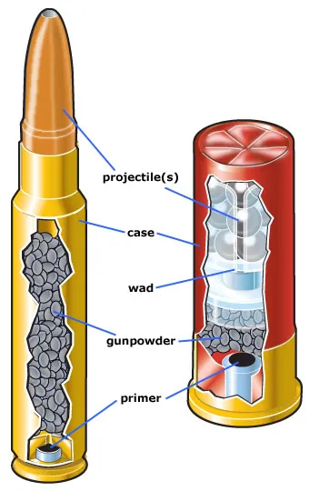

**case**: the container that holds everything together

**gunpowder**: a chemical mixture whose purpose is to propel projectiles through the expanding gases produced during the chemical reaction triggered upon ignition

**primer**: a chemical mixture that ignites the gunpowder

**projectile**: the object/s expelled from the barrel of the firearm

**wad**: an extra container, usually made of paper or plastic, that separates the gunpowder from the slug or shots

Image Source: [https://ke-courses-production.s3.amazonaws.com/asset_files/production/655/attachments/original/ammo_basic_components.jpg?1497618021](https://ke-courses-production.s3.amazonaws.com/asset_files/production/655/attachments/original/ammo_basic_components.jpg?1497618021)

## General Types of Ammunition

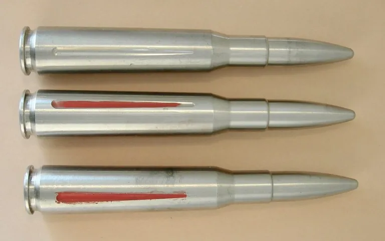

**drill**: does not contain gunpowder

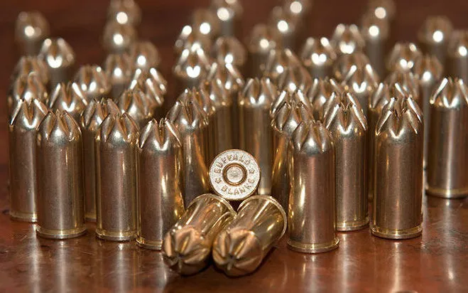

**blank**: does not contain bullets

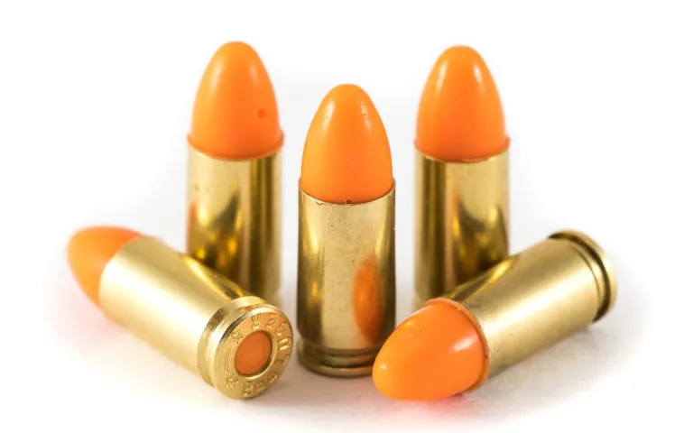

**dummy**: used as a model

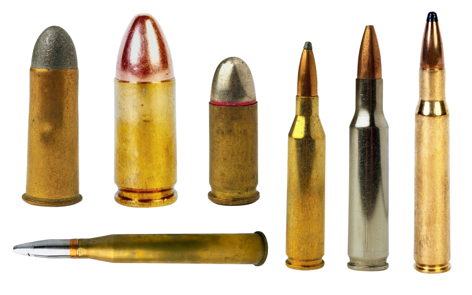

**live ammunition**

## Classifications of Cartridges

### According to Location of Primer

**Pinfire**

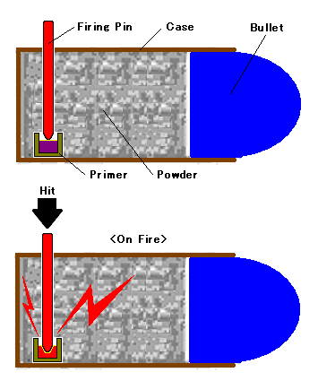

The ignition cap (primer) is concealed inside the cartridge case and has a pin resting upon it

By Amenhtp – Own work, Public Domain, [https://commons.wikimedia.org/w/index.php?curid=6652833](https://commons.wikimedia.org/w/index.php?curid=6652833)

**Rimfire**

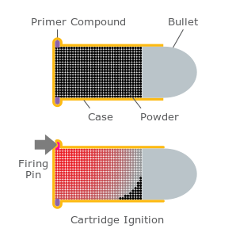

The priming mixture is located at the hollow rim of the case; Can be fired if the cartridge is struck by the firing pin on the rim of the case (cavity rim)

By Arz – Own work, CC BY-SA 3.0, [https://commons.wikimedia.org/w/index.php?curid=10972030](https://commons.wikimedia.org/w/index.php?curid=10972030)

**Centerfire**

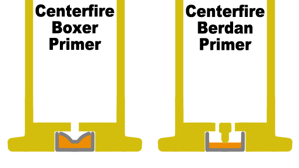

The primer cup (ignition cup) is centrally placed in the base of the cartridge case and the priming mixture is exploded by the impact of the firing pin and with the support of the anvil

By Arz – Own work, CC BY-SA 3.0, [https://commons.wikimedia.org/w/index.php?curid=10972030](https://commons.wikimedia.org/w/index.php?curid=10972030)

### According to Rim Diameter

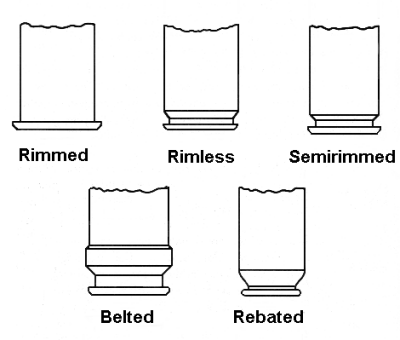

**rimmed** It has a flange at the base which is larger than the diameter of the body of the cartridge case. This flange is to enable the cartridge to be extracted from the weapon in which it is used.

**rimless** The flange diameter is the same as the body and there is, for extraction purposes, a groove around the case body just in front of the flange.

**semirimmed** It has a flange which is slightly larger than the diameter of the cartridge case and a groove around the case body just in front of the flange.

**belted** It has a pronounced raised belt encircling the base of the cartridge, the belt is for additional strength in high pressure cartridge.

**rebated** It has an extractor flange which is less than the diameter of the cartridge case.

### According to Caliber

**Cal. .22** about 5.59 mm used in revolver, pistol and rifles

**Cal. .25** about 6.35 mm used in pistols and rifles.

**Cal. .30** about 7.63 mm (mauser) for carbines and other rifles

**Cal. .30** about 7.63 mm (luger)

**Cal. .32** about 7.65 mm for automatic pistols and revolvers

**Cal. .357** used in magnum .357 revolvers

**Cal. .380** about 9 mm used for pistols

**Cal. .45** about 11 mm used in automatic pistols

**Cal. .50** used in .50 cal. machine gun

## Shotgun Cartridges

A **shotgun cartridge** is a complete unit of unfired cartridge consisting of the pellets, primer, case, wads and gunpowder.

### Gauge of a Shotgun

The unit of measurement of shotgun cartridges is expressed in **gauge**. This measure is based upon the number of solid lead balls contained. This number is limited by the size of the individual balls. Below is a summary table of shotgun gauges and the equivalent diameter in inches.

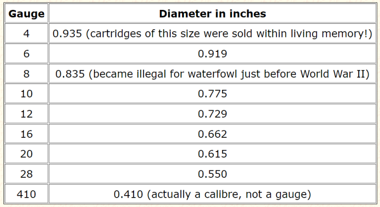

Source: [https://www.sizes.com/sports/shotguns.htm](https://www.sizes.com/sports/shotguns.htm)

At present, the 10-gauge shotgun is the biggest one available while the 410 is the smallest. As noted in the table, the 410 is a caliber and not a true gauge measure.

### Types of Shots

* **Soft or Drop Shot** made of pure or nearly pure lead to which a small amount of arsenic has been added to make it take on the form of a spherical drop as it falls down the shot tower; easy to deform or flatten; loses its velocity quicker; low penetrating power and string out more
* **Chilled or Hard Shot** made with lead containing a small amount of antimony to increase its hardness; does not deform easily; has better patterns, less string and more uniform velocity and penetration
* **Coated or Plated Shot** also called a lubaloy shot; a chilled shot coated with thin copper through electroplating design for greater strength and elasticity; great resistance to deformation and leading and better pattern
* **Buck Shot** large lead shot

## Primers

A **primer** is the assembly which ignites the propellant. It contains a highly sensitive chemical compound that would easily ignite or burst into flames when struck by the firing pin. It is also known as the percussion cup.

**Parts of the Primer** 

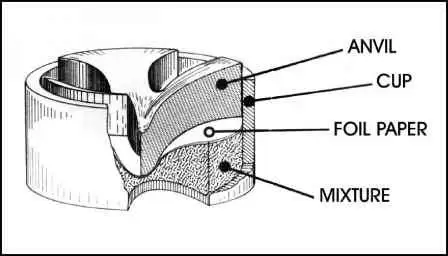

**anvil** provides solid support and absorbs the blow of the firing pin causing friction that would initiate ignition

**primer cup** brass gliding metal cup which contains the priming mixture, the disc and the anvil

**disc** a thin paper or foil which is pressed over the priming mixture in order to keep it in place and protect it from moisture

**priming mixture** the highly-sensitive chemical compound which ignites the firing pin by mechanical blow; also called percussion powder

Source: [https://www.bevfitchett.us/basic-ballistics/images/2746_26_15-ballistics-different-parts-primer.jpg](https://www.bevfitchett.us/basic-ballistics/images/2746_26_15-ballistics-different-parts-primer.jpg)

## Gunpowders

Also called ***propellants***, **gunpowders** are chemical mixtures designed to shoot projectiles by means of the expansive forces produced during burning.

### The Black Powder

This is the oldest known explosive. Chinese alchemists who discovered it initially called it “*fire medicine*.” It is made of the following:

* saltpeter 75%
* charcoal 15%
* sulfur 10%

As demonstrated in the video, black powder generally produces a lot of smoke. Additionally, it also leaves a considerable amount of residue in the barrel. Both of these characteristics are considered disadvantageous. Hence, the need to remedy both.

### Smokeless Powder

This type of gunpowder was created in response to the aforementioned problems with regular black powder. ***Nitroglycerin*** and ***nitrocellulose*** are the main ingredients of the smokeless powder. They are mixed with one or two other minor ingredients such as centralite, Vaseline esters, and inorganic salts among others.

**Types of Smokeless Powder**

1. **Single Based** Primarily consists of *nitrocellulose*, it delivers clean and consistent combustion. It’s widely used in various ammunition types due to its reliable performance and minimal smoke production.
2. **Double Based** This combines *nitrocellulose* with *nitroglycerin*, offering enhanced energy output for high-performance ammunition. While it provides more power, it tends to leave slightly more residue compare to single-based powders.
3. **Triple Based** It incorporates *nitrocellulose*, *nitroglycerin*, and *nitroguanidine*. It is typically reserved for specialized applications like military or high velocity ammunition. It provides exceptional performance, but is more sensitive to temperature and pressure variations.
4. **High Ignition Temperature Propellant** This was engineered with a higher ignition threshold. It is commonly used in heavy weaponry and artillery to reduce the risk of accidental ignition from heat or sparks, ensuring safety during ignition.

## Bullets

The word “**bullet**” was derived from the French word “***boullette***” which means a small ball. This term is generally used when we are referring to a projectile fired from any small arms. It has a has a variety of forms, especially during its early history. In a more technical sense, “bullet” refers to a metallic or non-metallic cylindrical ball propelled from a firearm. It is sometimes called a “**shot**” or a “**slug**.”

### General Types of Bullets

* **Lead Type** named so because it is composed of the metal lead or an alloy of this metal such as tin and antimony
* **Jacketed Type** has a lead core that is coated with a harder metal such as a copper alloy

### Types of Bullets According to Their Maximum Effect on the Targets

* **Ball Type** intended for anti-personnel and general use
* **Armor-piercing** designed to penetrate light steel armor
* **Explosive** contains a small charge of explosive that detonates on impact
* **Incendiary** used to cause fire on a target
* **Tracer** allows the gunner to observe the path of the shot as it leaves visible marks on traces while in flight

## Cartridge Cases

As previously discussed, the cartridge case is the container of all the other parts of an ammunition. This could be metallic or non-metallic, but it is usually made of brass (70% copper, 30% zinc). It is also know as the “**shell**” or “**casing**“.

### Functions

* Places the bullet properly relative to the bore of the firearm
* Carries the means of ignition
* Provides a gas seal at the breech against an unwanted escape of propellant gas upon firing
* Waterproofs the propellant or powder charge
* Insulates the propellant from the hot walls of the chamber during rapid firing

### Parts

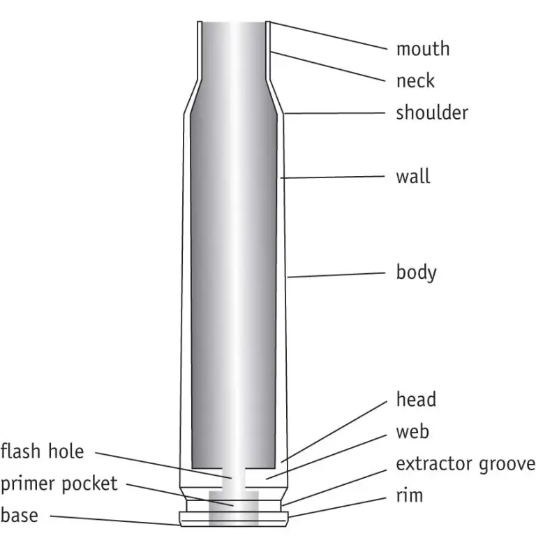

* **mouth** top end of the case
* **neck** part occupied by the bullet
* **shoulder** supports the neck
* **wall** main casing
* **body** houses the gunpowder
* **head** along with the body, constitute the “**cork**” that plugs the breech of the barrel against the escape of the gas
* **web** bottom of the primer pocket
* **extractor groove** allows the automatic withdrawal of the case after firing
* **rim** limits the forward movement of the cartridge to the chamber
* **base** bottom portion of the cartridge which contains the headstamp marking
* **primer** pocket holds the primer securely, prevents the escape of gas to the rear of the cartridge, provides support for the anvil
* **flash hole** also called a “vent“, passageway for the priming mixture to ignite the propellant charge

Source: [https://www.longrangehunting.com/attachments/cartridge-case-parts-jpg.244132/](https://www.longrangehunting.com/attachments/cartridge-case-parts-jpg.244132/)

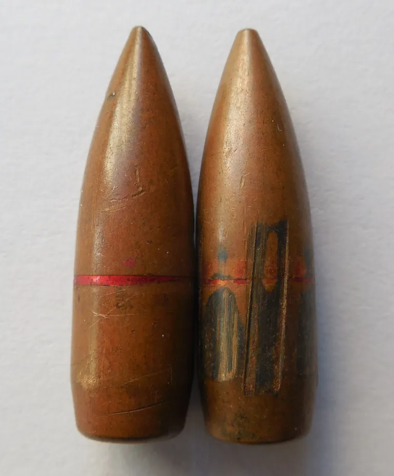

The **cannelure** is the cylindrical groove on the outer surface of the cartridge designed to secure the shell to the chamber, as well as prevent the bullet from being pushed down to the powder charge. In some instances, it can be utilized for identification.

By Vic2015 – Own work, CC BY-SA 4.0, [https://commons.wikimedia.org/w/index.php?curid=45649859](https://commons.wikimedia.org/w/index.php?curid=45649859)
