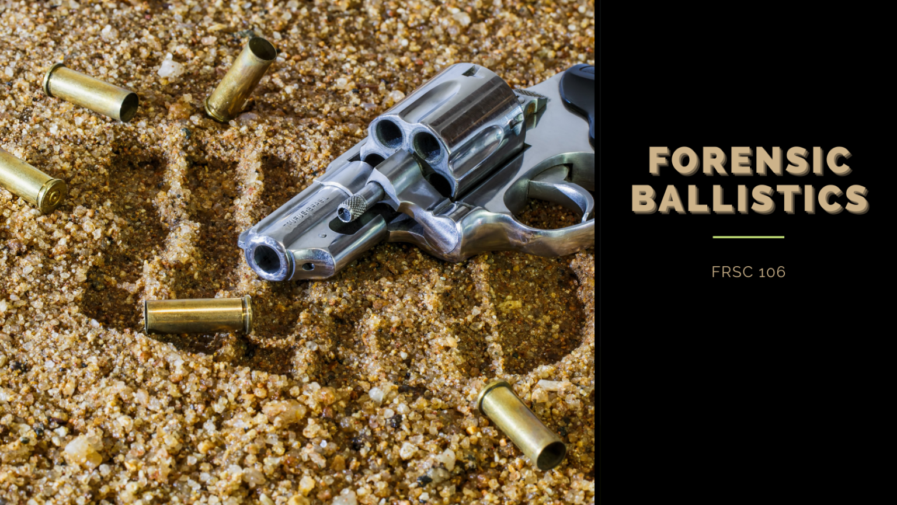

---js
const eleventyNavigation = {
	key: "The Forensic Ballistics Laboratory",
	parent: "Forensic Ballistics",
	title: "Forensic Ballistics: Chapter 4, The Forensic Ballistics Laboratory"
}
---

# The Forensic Ballistics Laboratory

## Laboratory Equipment Used in the Examination of Firearms, Cartridges, Fire Bullets, and Allied Matters

* **Analytical or Torsion Balance** This is used for determining weights of bullets or shotgun pellets for possible determination of type, caliber, and make of firearms.

* **Bullet Comparison Microscope** The most important equipment for scientific firearms examination. It is used for comparing evidence shells and bullets and test shells and bullets to determine whether they are fired from the same gun or not. Bullet comparison microscope was introduced in 1925. The first person to own and use this equipment is Dr. Calvin H. Goddard, known as the Father of Modern Ballistics. To date, bullet comparison microscopes are used with ease and convenience because of the technology. It is prominently used to determine the similarity and dissimilarity between two fired bullets or two cartridge cases by simultaneously observing their magnified image. It is actually two microscope couple together with a single or two eye piece, so that when one looks through this comparison microscope eye piece, he is seeing one half of what is under the other-in other words, half of the evidence bullet and half of the test bullet.

* **Bullet Recovery Box** Used in obtaining best fired bullet or test fired cartridge cases from the suspected firearms submitted to the ballistics laboratory.

* **Chronograph** Used to determine the speed of the bullet or the muzzle velocity of the bullet.
Comparison Projector Similar to the comparison microscope. Two fired bullets or two fired shells can be compared in one setting of the firearm examiner. A magnified image appears on the large screen and can be in a comfortable viewing distance, comparison of evidence is faster, easier, and less tiresome.

* **Electric Marker and Stylus** Used in the laboratory for marking fired bullets, fired shells, and firearms submitted for examination.

* **Helixometer** Used in measuring the pitch of the rifling.

* **Magnifying Glass** Used for preliminary examination and orientation purposes of the different marks (striation) on a bullet, shell, and firearms.

* **Measuring Projector** Used to determine the width of the lands and grooves, diameter, and twist of fired bullets.

* **Micrometer** Have the same use as in helixometer.
Onoscope Used in examining the interior surface of the barrel.

* **Shadowgraph** Another instrument whose function is similar to a microscope. It contains a series of microscopic lenses of different magnifications that can be used in examining fired bullets or fired shells to determine their class characteristics especially for preliminary examination and orientation purposes.

* **Stereoscopic Microscope** Used in the preliminary examination of fired bullets and fired shells. To determine the location of the extractor marks and ejector marks for orientation purposes. It can be used also in one close-up examination of tampered serial number.

* **Taper Gauge** Used for determining the diameter of the bore of the firearms.

* **Vernier Calipers** Used to determine the bullet diameter and barrel length.

## Crime Scene Processing for Firearms, Bullets, Ammunition, and Firearm Accessories

### Evidence Collection

#### Collection of Fired Bullets

The investigator should observe the proper way and appropriate tools in collecting pieces of evidence relevant ta firearm examination. This protocol should be done to retain the evidence’s evidentiary value. The following are some of the procedures for collecting the evidence:

1. If the bullet is stuck on wood, splitting the wood until the projectile is detached is the recommended method. The portion of the wood will be transmitted to the laboratory. Let the laboratory personnel remove it.

2. If the bullet pierced off the wall, do not dig out the evidence with a knife or any pointed instrument. Instead, widen the part of the hole using the approprate digging tool until the bullet can be removed with no unnecessary seratches.

#### Collection of Evidence Firearm

The following are the procedures for collecting the evidence firearm:

1. Pick up the firearm using a handkerchief or small string to be inserted in the trigger guard.

2. As a safety precaution, the muzzle end of the evidence firearm should not point to any person.

3. If it is a revolver that is in full cocked position, never attempt to squeeze the trigger nor gradually return the hammer to a downward position. Instead, place a crumpled paper or similar material in front of the open hammer to prevent from striking the firing pin. Afterward, fasten the material with an adhesive tape.

## Marking the Evidence and Test Fired Bullets and Cartridge Cases

### Marking of Fired Bullets

The mark on the evidence bullet is the investigator’s engraved initials and the date of recovery on its base or ogive. It can be done using a stylus or any pointed instrument, tis emphasized that the markings should not be engraved on the bearing surface since this part receives the significant markings from the gun’s rifling.

### Marking of Fired Cartridge Cases

The following are the parts of the cartridge case where the investigating officer should engrave his markings:

1. Inside, near the open mouth.
2. Outside, near the open mouth.
3. On the body of the shell, after examining the presence of chamber markings.

The investigators are prohibited from engraving his markings on the base since this receives individual characteristics after it comes in contact with the breech face of the firearm.

### Marking of Suspected Firearms

Any suspected firearm should be marked by the investigator or police officer who recovered it, with his initials and corresponding date, on any of the three main and separable parts, barrel, cylinder, and frame, in case of revolver and barrel, slide, frame or receiver, in case of a pistol. Of course, this is done without utter disregard for taking down the serial number of the firearm.

## DON’Ts

The following are don’t’s in marking firearm, bullet, and shell:

1. Never use (x) as an initial for identifying mark;
2. Do not put any identifying mark in a cylinder or peripheral surface of any bullet or slug.
3. Do not put any identifying mark on the base of a shell;
4. Do not put any identifying mark on any separable part of a firearm.

## Preservation of Ballistic Evidence

The following are the most important reasons for the marking of evidence:

1. The officer may be called to the witness stand several weeks or month later, or even years later after the commission of the crime, to identify the object he collected at the time of the offense;
2. The officer can not completely rely on his memory because there will be many more cases that he will handle after every case; and,
3. Defense counsel may require that the complete “chain and custody of evidence” be established.

The following are the methods for preserving ballistics evidence:

1. The evidence bullets, shells, metallic fragments, and similar pieces of evidence should be wrapped in tissue paper before they are placed in pill box, match box, vial, or any similar container.
2. These should be wrapped separately to avoid contact with each other, which may result in unnecessary markings.
3. The container should also be properly labeled with a tag.
4. Evidence firearm should be properly placed in the container box or cartoon so that it is free from modification and contamination of latent print.
